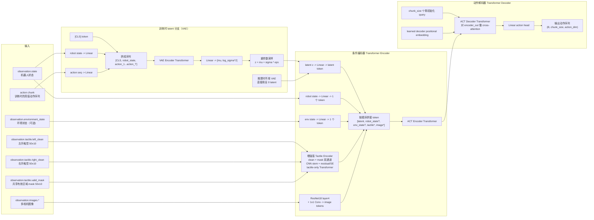
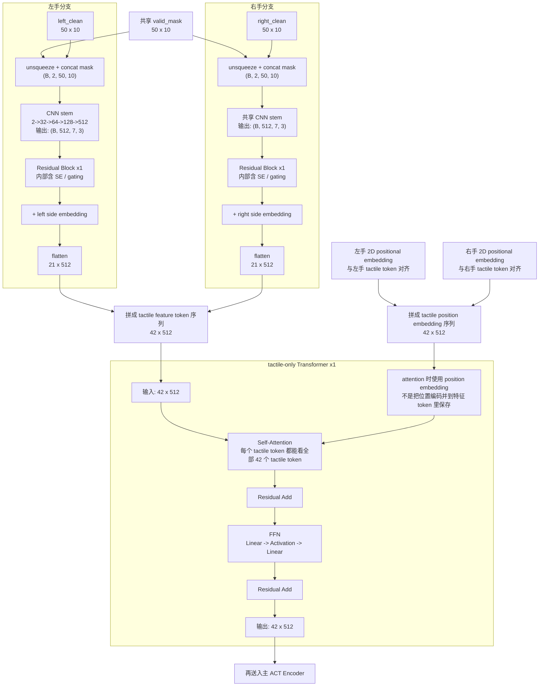

# ACT Policy 主要网络结构图（当前实现，含增强版 Tactile Encoder）

本文基于当前仓库里的 ACT 实现整理，不是论文里的抽象示意图，而是尽量贴近代码真实结构，尤其补充了 tactile encoder 的详细拆解，方便第一次接触 ACT 和触觉输入的新手理解。

主要参考实现：

- `src/lerobot/policies/act/modeling_act.py`
- `src/lerobot/policies/act/configuration_act.py`
- `src/lerobot/configs/franka_research3_ee2ee_act_das.yaml`
- `docs/fr3_act_tactile_encoder.md`

---

## 1. ACT Policy 总览图

这张图回答一个核心问题：

> 当前仓库里的 ACT，是怎么把机器人状态、触觉、图像一起变成动作序列的？



---

## 2. 一句话先看懂整条链路

如果你完全是第一次看 ACT，可以先记住下面这句话：

> ACT 的核心思路，就是把不同模态的数据都变成 token，然后让 Transformer Encoder 统一融合，再让 Transformer Decoder 一次性预测一串未来动作。

这里的几种 token 可以粗略理解为：

- `latent token`：训练时从真实动作序列里提炼出的一个“隐藏意图摘要”
- `robot state token`：机器人当前自身状态
- `env state token`：环境状态，可选
- `tactile tokens`：由 2D 触觉图编码出来的一串 token
- `image tokens`：由图像 backbone 提取出来的一串 token

---

## 3. 当前 tactile 分支到底怎么做

当前实现并不是把触觉直接 flatten 成一个长向量塞进 `observation.environment_state`，而是：

1. 左右手各取一个 `clean tactile map`
2. 额外拼接一个共享的 `valid_mask`，形成 `clean + mask` 两通道输入
3. 先用共享的 CNN stem 做局部空间特征提取和下采样
4. 在 CNN 输出后加轻量 residual block，且 block 内部带 SE/gating 做通道重标定
5. 给左右手分别加一个 side embedding
6. 展平成 tactile tokens
7. 先经过 1 层 tactile-only Transformer 做触觉内部关系建模
8. 再把这些 tactile tokens 拼到 ACT encoder 输入序列里

这也是为什么触觉分支更像“一个小型视觉分支 + 小型 token 精炼器”，而不是普通 MLP。

---

## 4. Tactile Encoder 细化图

当前 FR3 tactile 数据每侧输入形状是：

- 单侧：`50 x 10`
- `valid_mask`：`50 x 10`
- 输入给卷积时：`(B, 2, 50, 10)`，即 `clean + valid_mask`

配置中当前隐藏通道为：

- `[32, 64, 128]`

输出通道直接对齐 Transformer 的 `dim_model=512`。



---

## 5. 为什么触觉最后会变成 21 个 token

这是新手最容易卡住的地方。

单侧触觉输入大小是：

- `50 x 10`

经过 3 次带 stride 的卷积后，空间尺寸变成：

1. `50 x 10`
2. `25 x 10`
3. `13 x 5`
4. `7 x 3`

所以最后 feature map 的空间网格是：

- `7 x 3`

把这个网格展平后：

- `7 * 3 = 21`

所以：

- 左手产生 `21` 个 tactile token
- 右手产生 `21` 个 tactile token
- 总共 `42` 个 tactile token

每个 token 的特征维度都是：

- `512`

也就是和 ACT 的 `dim_model` 对齐。

---

## 6. 为什么左右手可以共用一个 tactile encoder

这里的设计很关键：

- 左右手的 tactile 图，本质上都是同一种传感器格式
- 因此“如何从触觉图里提取接触模式”这件事，可以共享同一套卷积权重
- 这样参数更省，也更容易学到稳定模式

但如果完全共享，又会有一个问题：

> 模型怎么知道当前这组特征是左手还是右手？

所以这里额外加了：

- `side embedding`

你可以把它理解成一个“身份标签”：

- 左手特征 + 左手标签
- 右手特征 + 右手标签

这样模型既能共享“怎么看触觉”，又不会搞混“这是哪只手”。

---

## 7. 为什么还要加 2D positional embedding

因为卷积输出是一个 `7 x 3` 的二维网格。

如果直接 flatten 成 21 个 token，Transformer 只会看到：

- token1
- token2
- token3
- ...

但它不知道这些 token 在原始触觉图上分别对应哪里。

所以这里额外加了：

- `2D sinusoidal positional embedding`

作用就是告诉模型：

- 这个 token 来自上方还是下方
- 来自左边还是右边
- 不同 token 在 2D 触觉图上的相对位置关系是什么

这和视觉 Transformer 里给 image patch 加位置编码是同一个思路。

---

## 8. Encoder 看到的最终 token 序列长什么样

当前实现里，进入 ACT Encoder 的 token 顺序是：

```text
[latent,
 robot_state?,
 env_state?,
 tactile_tokens_left,
 tactile_tokens_right,
 image_tokens_cam1,
 image_tokens_cam2,
 ...]
```

其中：

- `?` 表示可选
- tactile token 在 image token 之前

这意味着 tactile 和 image 在结构上是并列模态，都会被 Transformer Encoder 一起融合。

需要注意的是，现在 tactile token 在进入主 Encoder 之前，已经先经过了一次 tactile-only Transformer 精炼。这一步的作用不是替代主 ACT Encoder，而是先让触觉 token 在模态内部做一轮关系建模，再去做多模态融合。

---
## 9. 训练时和推理时最大的区别

### 训练时

训练时有真实动作序列 `action chunk`，所以可以走 VAE 分支：

1. 把 `[CLS, robot_state, action_sequence]` 送进 VAE encoder
2. 得到 `mu` 和 `log_sigma^2`
3. 采样出 latent `z`
4. 再把这个 `z` 当作条件 token 的一部分送给主 Encoder

这样模型会学习一种“从动作分布中抽象出隐变量”的能力。

### 推理时

推理时没有真实未来动作，所以不能走 VAE encoder。

当前实现的做法非常直接：

- latent 直接用全 0 向量代替

然后继续：

- 编码当前观测
- 预测一整段 action chunk

---

## 10. 小白版总结

如果你只想抓住最核心的理解，可以记成下面 5 句话：

1. ACT 不是一步一步出动作，而是一次预测一整段动作。
2. 它会把状态、图像、触觉都转成 token，再一起交给 Transformer Encoder。
3. 当前 tactile 输入已经从 `clean-only` 升级为 `clean + valid_mask` 两通道。
4. 触觉主干仍然以 CNN 为主，但在 CNN 后增加了 residual/SE 和一个很小的 tactile-only Transformer。
5. 左右手共用同一个 tactile CNN stem，但通过 side embedding 区分左右手。
6. 最后 Decoder 基于融合后的 token，一次生成 `chunk_size` 个未来动作。

---

## 11. 和当前仓库实现对应的关键点

当前仓库里与上图直接对应的实现要点包括：

- `ACTTactileEncoder`：CNN stem + residual block 的触觉编码器
- `ACTSqueezeExcitation`：通道 gating
- `ACTTactileTransformer`：触觉内部的小型 Transformer 精炼层
- `encoder_tactile_side_embed`：左右手 side embedding
- `ACTSinusoidalPositionEmbedding2d`：2D 位置编码
- `_append_tactile_tokens(...)`：把左右手触觉编码结果追加进 encoder token 序列
- `encoder`：融合多模态 token
- `decoder`：基于 encoder 输出预测 action chunk

如果后续要继续补图，最值得再补的两张图通常是：

- `ACT Encoder / Decoder` 内部单层结构图
- 训练 loss 图（`L1 + KL`）和推理时 temporal ensemble 图

---

## 12. 三个设计问题的当前结论

### 12.1 为什么加 `clean + valid_mask` 两通道

因为：

- `clean` 里虽然已经乘过 `valid_mask`
- 但 `0` 既可能表示“无效区域”，也可能表示“有效区域但当前没有接触”

把 `valid_mask` 显式作为第二通道输入，相当于直接把传感器几何先验告诉模型，减少模型自己猜“哪些 0 是天生无效”的负担。

### 12.2 为什么在 CNN 后面加 residual block 或 SE/gating

因为：

- residual block 更适合在已有局部触觉特征上做“增量修正”，训练更稳
- SE/gating 可以根据当前输入动态强调更有用的通道，抑制噪声通道

这类改动比直接推翻 CNN 主干更小、更稳，也更符合当前触觉图的小尺寸特点。

### 12.3 为什么试 `CNN stem + 1~2 层 tactile-only Transformer`

因为：

- CNN 擅长局部空间结构
- Transformer 擅长 token 间的全局关系

所以这里采用的是折中方案：

- 先用 CNN 把 `50x10` 压缩成少量 tactile token
- 再用很小的 Transformer 只在 tactile token 内部建模
- 最后再送进主 ACT Encoder 和图像、状态一起融合

这比 pure Transformer 更节省 token 和算力，也比 pure CNN 更容易建模非局部接触关系。
