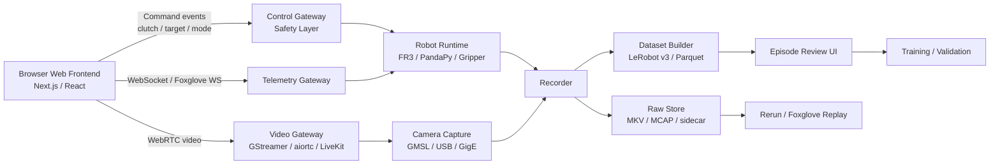

现在具身数据采集有什么SOTA的前端方案? 或者不局限于数采, 放眼general SOTA的前端方案, 最好是网页版

我的判断：**具身数据采集的 SOTA 前端，不是单一“好看的网页”，而是 Live Teleop + 多模态观测 + 数据质检 + 回放/标注 + 训练集管理的一体化 Web HMI。**
如果按你现在的 FR3 / Quest3 / 多相机 / LeRobot 管线来选，最优路线是：**Foxglove + Rerun + Vuer + 自研 Next.js 控制台**。

---

## 1. 现在最接近 SOTA 的几类方案

| 方向                  | 推荐方案                                          | 适合做什么                                | 是否网页版     |
| ------------------- | --------------------------------------------- | ------------------------------------ | --------- |
| 机器人实时观测 / 调试        | **Foxglove**                                  | ROS/MCAP/视频/状态/遥操作面板/日志检索            | 强         |
| 多模态时间线 / 3D / 数据回放  | **Rerun**                                     | 图像、点云、pose、轨迹、时间同步调试                 | 强         |
| VR / XR / Quest 遥操作 | **Vuer / TeleVuer**                           | Quest3、Vision Pro、浏览器 3D、WebRTC 视频回传 | 强         |
| LeRobot 数据集查看       | **LeRobot Dataset Visualizer**                | episode 回放、视频 + 状态曲线、数据检查            | 强         |
| 工业级 XR 数采框架         | **NVIDIA Isaac Teleop**                       | XR 设备、sim/real、retargeting、数据采集标准化   | 偏框架，不是纯网页 |
| 自研产品级控制台            | **Next.js + WebRTC + WebSocket + R3F/WebGPU** | 采集任务流、质检、标注、设备管理、权限、安全               | 最推荐长期做    |

Foxglove 现在的定位已经不是普通 ROS viewer，而是 robotics/autonomy 的 multimodal data platform，覆盖数据采集、可视化、日志检索和数据集整理；它还在推进远程可视化和遥操作能力。([Foxglove][1])

Rerun 更像是“机器人数据的时间线调试器 + 数据集可视化器”，适合把 image、point cloud、pose、action、timestamp、模型输出都打到同一个时间轴里，用来发现时序错位、frame gap、pose jump、相机外参问题。官方也明确强调它用于 visualizing robot runs 并转成 training datasets。([Rerun][2])

Vuer 是目前做 **Web/XR 机器人前端** 很值得关注的项目：它是面向 robotics/VR/AR 的轻量 3D 可视化工具，可以在移动设备和浏览器上运行；还有 Quest3 / Apple Vision Pro 通过 WebRTC 回传视频的 teleop demo。([GitHub][3])

LeRobot Dataset Visualizer 已经是很好的 episode 级浏览器：同步视频播放 + 图表 + LeRobot 格式数据探索，适合作为你后处理/QC 前端的参考。([GitHub][4])

NVIDIA Isaac Teleop 值得单独关注：它最新定位是高保真 egocentric 和 robot data collection 的统一框架，强调设备集成、human demo 数据采集标准化，以及 sim/real 互操作；但它更像底层采集/retargeting 框架，不是一个完整产品级网页前端。([NVIDIA GitHub][5])

---

## 2. 真正 SOTA 的前端形态：不是“看视频”，而是“采集驾驶舱”

我会把它设计成四个页面：

### A. Live Collection Console：实时采集台

核心能力：

* 多路相机预览，但不是 11 路全分辨率硬解；默认显示 mosaic / low-res proxy，点击某一路才切高清。
* 机器人状态：EE pose、joint、gripper、FT、latency、控制频率。
* Quest3 / SpaceMouse / 手柄状态。
* 当前 episode 状态：recording / paused / failed / saved。
* 一键标记：成功、失败、碰撞、遮挡、手进入画面、相机丢帧、pose gap。
* 安全控制：deadman、clutch、soft E-stop、速度限幅、workspace 限幅。

这里视频通道建议用 **WebRTC**，因为浏览器原生支持实时音视频和数据通道，不需要插件；MDN 和 WebRTC 官方都把它定义为浏览器内实时音视频和任意数据传输的标准能力。([MDN Web Docs][6])

### B. Episode Review Console：采后质检台

这部分才是具身数据采集的核心。

每条 episode 自动显示：

* 多相机同步回放
* action 曲线
* EE pose 曲线
* gripper width 曲线
* timestamp gap
* camera frame drop
* action delay
* SLAM / 6D pose gap
* success/fail 标签
* task instruction
* operator
* robot embodiment
* scene/object metadata

你现在做 LeRobot v3 的话，这个页面应该直接兼容：

```text
episode_index
timestamp
observation.images.*
observation.state
action
task
success
metadata
```

### C. Dataset Curation Console：数据集管理台

核心是“从采集数据变成训练数据”：

* 按任务、物体、场景、操作者、机器人、成功率筛选
* 批量剔除坏 episode
* 自动发现异常：帧率不稳、相机黑帧、pose jump、action saturation
* 导出 LeRobot / RLDS / Parquet / MCAP
* 支持 Dataset-Fed Validation：把真实 episode 喂给推理链，检查模型输入 contract 是否一致

Open X-Embodiment 和 DROID 都说明了现在具身智能数据的趋势：数据规模越来越大，跨机器人、跨场景、跨任务的数据需要统一格式和高质量管理。Open X-Embodiment 官方介绍为 1M+ real robot trajectories、22 种 robot embodiments；DROID 则包含 76k demonstrations、350h 数据、564 scenes、86 tasks、50 data collectors。([Robotics Transformer X][7])

### D. Model-in-the-loop Console：模型闭环前端

这部分是更 general SOTA 的方向：

* 选择 checkpoint
* 回放某个 episode
* 显示 human action vs model action
* 可视化 action error
* 可视化 attention / language grounding / affordance map
* 在线 shadow policy：人遥操作时模型旁路推理，但不控制机器人
* 自动生成失败摘要：比如“夹爪提前闭合”“相机 2 被遮挡”“动作滞后 180 ms”

---

## 3. 我最推荐你的架构



### 前端技术栈

我建议：

```text
Next.js + React + TypeScript
Tailwind CSS + shadcn/ui
Zustand / Jotai：本地 UI 状态
TanStack Query：server state / dataset query
WebRTC：低延迟视频
WebSocket：遥测、控制事件、状态同步
React Three Fiber / Three.js / WebGPU：3D robot / point cloud / trajectory
Rerun / Foxglove embed：调试与回放
Tauri：需要本地硬件权限时打包成桌面版
```

Next.js 是 React 的全栈 Web 框架，适合做这类 dashboard；TanStack Query 适合处理异步 server state；Zustand 是轻量 React 状态管理；Tauri 适合把 Web 前端包成跨平台桌面应用，并保留本地系统能力。([Next.js][8])

浏览器端 3D/点云/轨迹可视化可以走 WebGL/Three.js，进一步追求性能可以看 WebGPU；Chrome 已经把 WebGPU 作为浏览器高性能 3D 图形和数据并行计算能力发布。([Chrome for Developers][9])

---

## 4. 对你当前项目的具体建议

你的场景不是普通“摄像头采集软件”，而是：

```text
FR3 + gripper + Quest3 / SpaceMouse + 多相机 + LeRobot + 训练/部署闭环
```

所以我建议分三步：

### 第一步：不要先自研大而全，先拼 SOTA 组件

最短路径：

```text
Foxglove：实时状态/视频/机器人 telemetry
Rerun：3D pose / 点云 / action timeline / replay
Vuer：Quest3 / VR teleop 页面
LeRobot Visualizer：episode review 原型
```

这一步目标不是产品化，而是把所有数据都“看得见”。

### 第二步：自研一个 Collection Web Console

只做你真正需要的差异化：

* 任务 instruction 输入
* episode 开始/结束
* 成功/失败/异常标签
* 多相机预览
* FR3 状态
* Quest3 controller 状态
* latency waterfall
* LeRobot schema 检查
* 一键导出 / 上传 / 训练

### 第三步：加入 AI Copilot

这是 general SOTA 的方向：

* 自动给 episode 起标题
* 自动标记失败原因
* 自动发现异常片段
* 自动生成数据集 card
* 自然语言搜索：“找所有夹杯子失败但抓到一半滑掉的 episode”
* 自动生成训练集 split
* 自动比较 human action 和 policy action

---

## 5. 我心中的“最终版”长什么样

一句话：**像 Foxglove + Rerun + Label Studio + Linear + Cursor 的结合体。**

左边是任务和数据集，中央是多相机同步时间线，右边是机器人状态和 action 曲线，底部是事件轨道：

```text
[Dataset / Task List]  [Multi-view Video + 3D Scene + Timeline]  [State / Action / QC]
                       [camera0 camera1 camera2 ...]
                       [EE pose curve]
                       [gripper curve]
                       [action curve]
                       [latency curve]
                       [event markers]
```

它应该有这些 SOTA 体验：

* **Timeline-first**：所有 image/state/action/event 都围绕时间轴。
* **Live = Replay**：实时采集和离线回放使用同一套 UI。
* **Schema-aware**：前端知道 LeRobot / MCAP / RLDS 字段含义。
* **Quality-first**：不是只录数据，而是边录边检查数据质量。
* **Safety-first**：网页只发 high-level command，真正安全控制在后端。
* **AI-assisted**：自动标注、自动查错、自动总结、自然语言检索。
* **Plugin-based**：相机、机器人、手柄、模型、数据格式都能插件化。

---

## 6. 我的推荐结论

如果你想最快落地：

```text
短期：
Foxglove + Rerun + Vuer + LeRobot Visualizer

中期：
自研 Next.js Collection Console

长期：
做成 Web-first Embodied Data OS
```

更具体一点，我会选这个组合：

```text
实时遥操作前端：Vuer / custom Next.js
实时观测调试：Foxglove
多模态回放调试：Rerun
数据集 review：自研 LeRobot Review UI
底层视频：WebRTC
底层控制：WebSocket + Safety Gateway
底层日志：MCAP + sidecar + LeRobot v3
桌面增强：Tauri
```

对你来说，**最值得自研的不是 3D viewer，也不是视频播放器，而是“数据采集任务流 + 质检 + LeRobot schema + 训练闭环”这一层。** 这层目前开源生态还没有完全满足真实机器人团队的需求，也是最有产品价值的部分。

[1]: https://foxglove.dev/?utm_source=chatgpt.com "Foxglove - Visualization and observability for robotics ..."
[2]: https://www.rerun.io/?utm_source=chatgpt.com "Rerun — Rerun"
[3]: https://github.com/vuer-ai/vuer?utm_source=chatgpt.com "Vuer is a 3D visualization tool for robotics and VR ..."
[4]: https://github.com/huggingface/lerobot-dataset-visualizer?utm_source=chatgpt.com "huggingface/lerobot-dataset-visualizer: Web application for ..."
[5]: https://nvidia.github.io/IsaacTeleop/?utm_source=chatgpt.com "Welcome to Isaac Teleop"
[6]: https://developer.mozilla.org/en-US/docs/Web/API/WebRTC_API?utm_source=chatgpt.com "WebRTC API - MDN Web Docs - Mozilla"
[7]: https://robotics-transformer-x.github.io/?utm_source=chatgpt.com "Open X-Embodiment: Robotic Learning Datasets and RT-X ..."
[8]: https://nextjs.org/docs?utm_source=chatgpt.com "Next.js Docs"
[9]: https://developer.chrome.com/blog/webgpu-release?utm_source=chatgpt.com "Chrome ships WebGPU | Blog"
