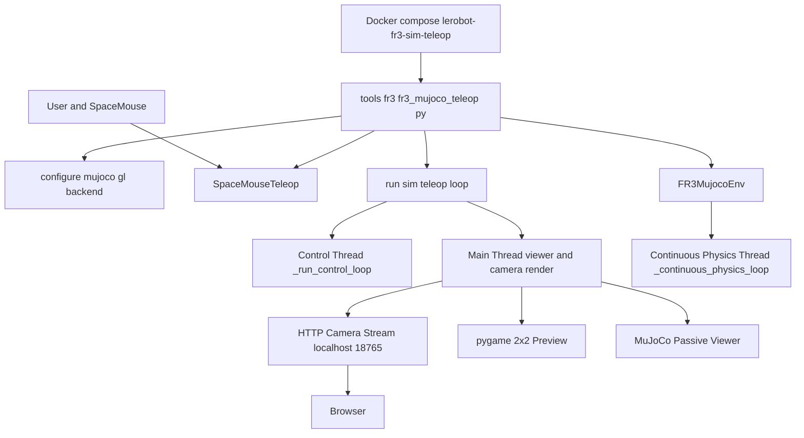
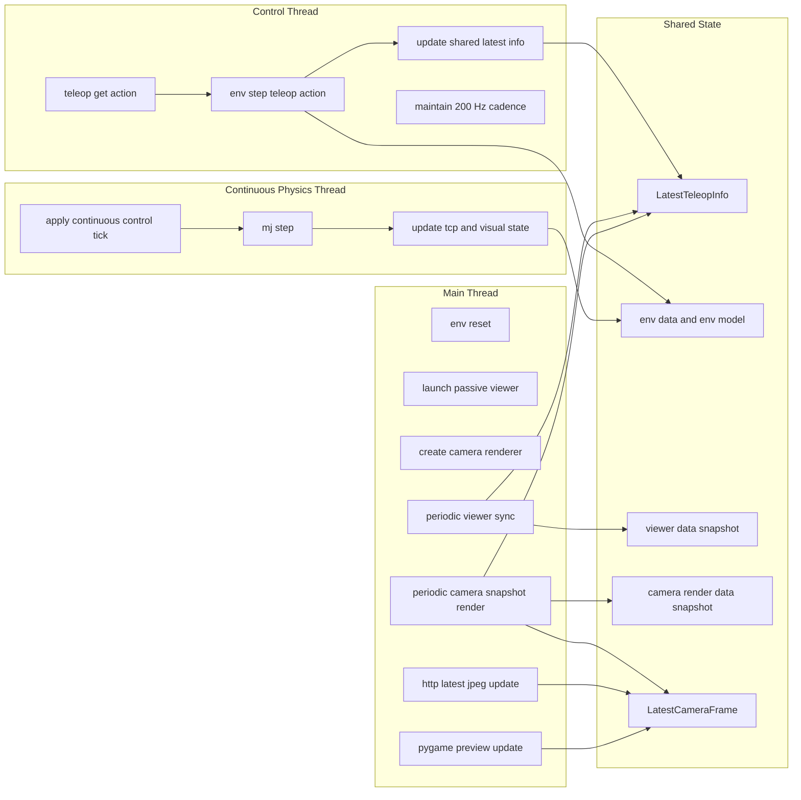
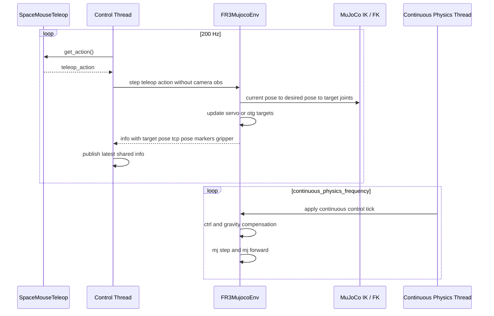
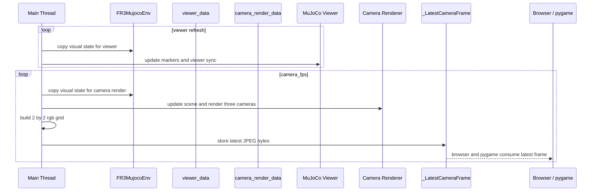
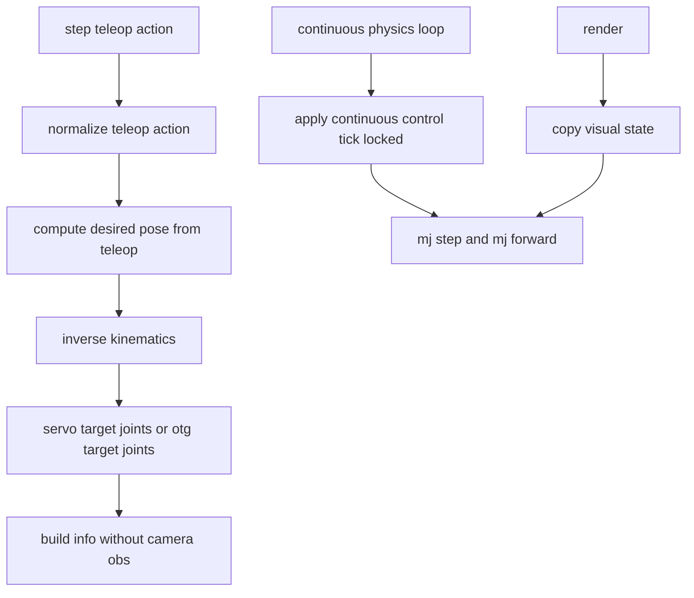

# FR3 MuJoCo Sim Teleop Architecture

日期：2026-04-22

本文整理当前 `tools/fr3/fr3_mujoco_teleop.py` 对应的 FR3 仿真 teleop 运行架构，聚焦以下几部分：

- 入口脚本与运行时配置
- SpaceMouse 到 FR3 控制链
- 主线程 / 控制线程 / 连续物理线程的职责划分
- viewer 与 camera stream 的渲染路径
- `MUJOCO_GL` 的实际约束

## 1. 总体组件图



## 2. 线程与职责划分



## 3. 控制链路



## 4. 渲染链路



## 5. FR3 MuJoCo Env 内部关系



## 6. 关键约束

- `tools/fr3/fr3_mujoco_teleop.py` 是入口，负责解析参数、构建 `SpaceMouseTeleop`、构建 `FR3MujocoEnv`、配置 `MUJOCO_GL`、启动 viewer 和 teleop loop。
- 当同时启用 `viewer` 与 `--enable-cameras` 时，运行时默认会把 `MUJOCO_GL` 从缺省值或 `egl` 切到 `glfw`。
- 控制与渲染已经解耦：
  - 控制线程只做 `get_action -> step_teleop_action`
  - 主线程独占 MuJoCo viewer 与 camera renderer
- camera stream 不再通过磁盘写图传递，而是维护内存中的最新 JPEG。
- viewer 和 camera renderer 都基于 `copy_visual_state()` 的快照工作，避免直接把长时间渲染锁持有在控制线程上。
- `FR3MujocoEnv` 仍保留 continuous physics 线程，用于持续推进 MuJoCo 物理和 servo 执行。

## 6.1 已验证的 SpaceMouse 旋转语义

- 在当前 `pika_task_tcp` 轴约定下，`pitch` 与 `yaw` 的 SpaceMouse 语义和末端行为一致。
- `roll` 的 SpaceMouse 原始正方向与 FR3 sim 末端 `wx` 语义相反。
- 因此，`tools/fr3/fr3_mujoco_teleop.py` 默认将 `--scale-wx` 设为 `-0.001944`，等价于显式传入：

```bash
python tools/fr3/fr3_mujoco_teleop.py --scale-wx=-0.001944
```

- 这个修正只反转 `wx`，不修改 `wy` / `wz` 的默认符号。

## 7. 当前推荐运行方式

```bash
docker compose -f docker/docker-compose.yml --profile sim --profile teleop run --rm \
  -e DISPLAY=$DISPLAY \
  -e PYTHONPATH=/workspace/src \
  lerobot-fr3-sim-teleop \
  python tools/fr3/fr3_mujoco_teleop.py
```

在当前仓库默认配置下，上述命令会走：

- `MUJOCO_GL=glfw`
- `viewer` 保留
- `camera_fps=30`
- `fps=200`
- `continuous_physics=True`
- `use_otg=False`

## 8. 代码落点

- 入口脚本：`tools/fr3/fr3_mujoco_teleop.py`
- teleop 主循环：`src/lerobot/envs/fr3_mujoco_teleop.py`
- FR3 MuJoCo 环境：`src/lerobot/envs/fr3_mujoco.py`
- SpaceMouse teleop：`src/lerobot/teleoperators/spacemouse/teleop_spacemouse.py`
