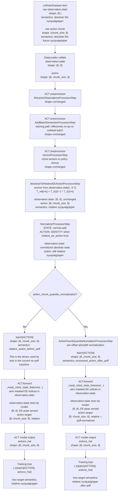

# FR3 Relative-Trajectory MVP (2026-03-31)

## Scope

This note defines the smallest defensible migration from the current FR3
`ee2ee` contract toward a UMI-style relative policy contract.

The goal of this MVP is not to fully reproduce UMI.

The goal is narrower:

- remove policy dependence on the SLAM world frame `W_s`
- preserve the current FR3 ACT training and runtime stack as much as possible
- keep wrist-mounted visual observations as the primary spatial cue
- avoid introducing `n_obs_steps > 1` in the first cut

This note is intentionally about the MVP only.

It does not define the full future history-based contract.

## Problem Statement

Current dataset facts:

- training data in `outputs/datasets/lerobotv3_0310_100ep_aligned_ts` comes from SLAM
- `observation.state` stores end-effector pose in SLAM world frame `W_s`
- `action` also stores future EE pose in `W_s`
- current FR3 `ee2ee` ACT checkpoints therefore learn a policy-private contract that depends on `W_s`

Current practical consequence:

- if the robot base is moved relative to the original SLAM world frame, the
  policy still reasons in the old global frame
- current runtime can compensate with `T_B_Ws`, but that is an adapter fix for a
  world-frame-dependent policy, not a calibration-free contract

New assumption confirmed for this design:

- `left` and `right` are both mounted on the wrist

That makes a relative contract much more attractive, because the dominant visual
input already moves with the end effector.

## Non-Goals

This MVP does not attempt to:

- support `n_obs_steps > 1`
- add explicit history-based velocity cues
- redesign the ACT backbone
- rewrite the dataset on disk into a new canonical storage format
- remove backward compatibility for existing `ee2ee` checkpoints

Those belong to the second-stage UMI-style design.

## Current Constraints

### ACT Observation Horizon

Current ACT implementation rejects `n_obs_steps != 1`.

Consequence:

- the MVP must keep single-step observation input
- history-based relative proprio is explicitly deferred

### Current FR3 Contract Split

The repository already has a useful separation:

- robot canonical observation/action lives in FR3 runtime and robot processors
- checkpoint-specific contract lives in policy-facing adapters and processors

This is the correct seam for the MVP.

We should not rewrite the robot's canonical schema just to satisfy one training
representation.

## MVP Contract

### High-Level Decision

For the MVP:

- keep raw dataset storage in absolute `W_s`
- build a new policy-private representation on top of it
- anchor every action chunk to the current observation frame `t`
- optionally mask current EE pose from `observation.state` so the model does not
  depend on absolute pose leakage

In short:

- storage remains `W_s`-absolute
- policy contract becomes current-frame-relative

### Observation Contract

MVP observation contract:

- `observation.images.left`: unchanged
- `observation.images.right`: unchanged
- tactile inputs: unchanged
- `observation.state`: keep only gripper as useful proprio signal

Recommended MVP proprio behavior:

- enable `mask_ee_pose_in_state=true`
- keep `gripper` unmasked

Rationale:

- with a current-frame-relative action target, absolute EE pose in `W_s`
  provides no invariant benefit and still leaks global-frame dependence
- the repository already has a tested `mask2ee` path, so reusing it is cheaper
  than inventing a new partial-relative state contract for the first cut

Alternative, if explicit identity pose is preferred:

- convert current EE pose in `observation.state` to
  `[0, 0, 0, 0, 0, 0, 1, gripper]`

But the recommended MVP path is still:

- reuse `mask2ee`

because it is already implemented and checkpoint-stable.

### Action Contract

Current stored action:

- `T_Ws_E(t+k)` for each future offset `k`

New MVP policy action:

- `T_E(t)^-1 * T_E(t+k)`

Equivalent interpretation:

- each future target in the chunk is represented relative to the current end
  effector pose at inference/training step `t`

This means:

- the policy predicts future motion in the local end-effector frame
- the action contract no longer depends on `W_s`
- moving the base does not change the target semantics, as long as wrist images
  still observe the task geometry and the target remains reachable

### Rotation Representation

For the MVP:

- keep the runtime robot command output as absolute Cartesian pose with rotvec
- represent the relative target internally as relative pose
- prefer relative rotvec over relative quaternion as the first policy target

Reason:

- the current decode/runtime path already converts to absolute EE command with
  rotvec at the robot boundary
- relative rotvec is easier to interpret and clamp than raw relative quaternion
  components

If implementation pressure is low, 6D rotation can be revisited later.

### Gripper Contract

For the MVP:

- keep gripper as an absolute normalized open/close target

Do not make gripper relative in the first cut.

Reason:

- the main invariance problem is the world-frame dependency of the EE pose
- gripper already has local semantics and does not need the same treatment

## Why This Is The Smallest Defensible Cut

This MVP removes the highest-value dependency first:

- policy dependence on `W_s`

It avoids the largest immediate engineering cost:

- adding multi-step observation history to ACT

It also reuses an existing mechanism:

- `mask2ee` already provides the right first-step behavior for observation-side
  invariance

So the MVP asks the codebase to learn only one new idea:

- future action chunk is relative to the current observation frame

not two new ideas at once.

## Training Path Changes

### Keep Dataset On Disk Unchanged

Do not rewrite existing parquet episodes for the MVP.

Reason:

- existing tools, validation scripts, and old checkpoints still rely on the
  absolute `ee2ee` storage contract
- the relative representation can be derived on the fly from the stored
  absolute poses

### Add A Policy-Private Relative Action Transform

Training should derive chunk targets like this:

1. read current observation EE pose in `W_s`
2. read future action chunk absolute EE poses in `W_s`
3. convert each future target to pose relative to current observation pose
4. feed the relative chunk to the policy loss

This transform should happen in the policy-specific preprocessing path, not by
changing the robot core.

### Current Training Tensor Flow

The following diagram records the current implementation-level tensor flow for a
single dataset sample after collation into a training mini-batch.

Current assumptions:

- dataset still stores absolute `ee2ee` labels in `W_s`
- config uses `relative_ee_action=true`
- observation-side EE pose is masked before the ACT model sees `observation.state`
- the final loss target depends on whether qoff is enabled



Practical interpretation:

- raw dataset storage is still `ee2ee`
- the first semantic rewrite happens inside
  `AbsoluteToRelativeEEActionProcessorStep`
- `mask_ee_pose_in_state` does not rewrite the raw dataset item; it zeroes the
  configured EE-pose indices immediately before ACT forward
- therefore the model sees:
  - images and tactile as configured
  - `observation.state` with EE pose masked
  - `action` target already converted to `rel2ee`

Current important distinction:

- `relative_action_before_qoff` is the geometric relative target
- `processed_action_after_qoff` is the final training-space target when qoff is
  enabled

For the current `franka_research3_rel2ee_act_das_noqoff.yaml` baseline, the
loss is computed against `relative_action_before_qoff`, not against qoff-scaled
targets.

### Rotation Diagnostics And Loss Semantics

Current ACT rotation diagnostics use quaternion geodesic angle.

For predicted quaternion `q_pred` and target quaternion `q_gt`, both are first
renormalized:

- `q_pred_unit = q_pred / ||q_pred||`
- `q_gt_unit = q_gt / ||q_gt||`

Then the shortest-angle rotation error is computed from their inner product:

```text
rot_geodesic_rad = 2 * arccos(|<q_pred_unit, q_gt_unit>|)
rot_geodesic_deg = degrees(rot_geodesic_rad)
```

Equivalent intuition:

- if the predicted and target rotations are identical, `|dot| = 1` and the
  error is `0 deg`
- if they differ slightly, `|dot|` stays close to `1` and the error is small
- if they differ strongly, `|dot|` becomes smaller and the angle increases

The absolute value is required because quaternion sign is ambiguous:

- `q`
- `-q`

represent the same rotation.

This is why geodesic rotation error is a better diagnostic than quaternion
component L1/L2 distance:

- it measures the physical rotation discrepancy directly
- it is invariant to quaternion sign flip
- it aligns with the robot-side notion of pose error

Important distinction in current training logs:

- `rot_geodesic_deg` is a human-readable diagnostic metric in degrees
- `rotation_geodesic_loss` is the optimization term used in training, in
  radians

They are derived from the same geometric quantity, but they serve different
purposes:

- `rot_geodesic_deg` is easier to read in logs and compare against execution
  tolerances
- `rotation_geodesic_loss` is the scalar that enters the loss function

For the current ACT implementation, the action loss is conceptually split into:

- position L1 loss
- rotation geodesic loss
- gripper L1 loss

with quaternion renormalization applied in both:

- `ACT.forward(...)`
- `predict_action_chunk(...)`

so that training and inference use the same quaternion validity contract.

### Reuse `mask2ee` For Observation-State Leakage Control

Training config should:

- enable `mask_ee_pose_in_state=true`

That gives the MVP a clean observation-side invariant without needing a new
observation-state schema immediately.

## Inference Path Changes

Current runtime behavior:

- convert live robot observation into dataset frame using `T_B_Ws`
- feed policy an observation expressed in dataset/world terms
- decode policy action in dataset/world terms
- convert action back to base frame

MVP target behavior:

1. read current robot pose in base frame
2. treat that pose as the action anchor
3. build policy observation without exposing absolute EE pose
4. predict a relative future action chunk
5. compose the next relative target onto the current anchor pose
6. send the resulting absolute command to the robot

Consequence:

- the policy no longer needs `T_B_Ws`
- the runtime still emits absolute robot commands at the final boundary

## Recommended File-Level Changes

This section lists the intended edit surface, not exact implementation.

## Immediate Execution Plan

After the MVP code path exists, execute the next steps in this order:

1. run one real `rel2ee` training job
2. inspect one real preprocessed batch before trusting the loss curve
3. run FR3 preview mode with the new checkpoint
4. compare `ee2ee` and `rel2ee` on the target task

Important rule:

- do not jump to second-stage UMI features before these four checks are done

What matters first is not architectural completeness.

What matters first is whether removing the `W_s`-absolute action contract
actually reduces real back-half divergence.

### 1. New FR3 Relative Action Processor

Add a policy-private processor step that:

- takes current EE pose from observation
- takes absolute future `action` chunk from transition
- rewrites the action target into current-frame-relative pose

Likely home:

- `src/lerobot/processor/` or `src/lerobot/policies/act/`

Reasonable naming:

- `RelativeEEActionChunkProcessorStep`
- `CurrentFrameRelativeEEActionProcessorStep`

### 2. New FR3 Relative Action Decode Path

Add the inverse runtime step that:

- receives one predicted relative action
- composes it with the current live EE pose
- emits the canonical absolute robot command

This should happen before the final FR3 robot command is sent.

### 3. New ACT Config Variant

Add a dedicated config file rather than mutating the current `ee2ee` configs.

Suggested new config family:

- `franka_research3_rel2ee_act_das.yaml`

Suggested key behavior:

- `mask_ee_pose_in_state: true`
- `chunk_size`: keep current default initially
- `n_action_steps`: strongly consider reducing below `chunk_size` during early
  experiments

### 4. Keep Existing Absolute Runtime Path For Compatibility

Do not replace the current `ee2ee` runtime path.

Instead:

- add a new checkpoint contract branch
- route by checkpoint config

That keeps old checkpoints runnable and reduces migration risk.

## Recommended MVP Rollout

### Phase 1: Docs And Contract Declaration

- land this document
- add the new config name to FR3 docs once implemented
- explicitly document that the relative checkpoint contract is policy-private

### Phase 2: Training-Only Relative Target Support

- implement relative action target conversion in training
- keep inference untouched until the checkpoint can be produced
- verify saved checkpoint metadata clearly identifies the new contract

### Phase 3: Preview-Only Runtime Decode

- implement runtime relative decode
- run preview-only inference first
- verify predicted relative commands compose into sane absolute base-frame EE
  targets

### Phase 4: Limited Real-Robot Trials

- use short rollouts first
- prefer smaller `n_action_steps` during early validation
- verify base relocation robustness explicitly

## Acceptance Criteria

The MVP should be considered successful only if all of the following are true:

- a new checkpoint can be trained without using `W_s` as policy action semantics
- inference for that checkpoint no longer requires `T_B_Ws` as a semantic
  dependency
- the same checkpoint can run after base relocation without re-recording the
  dataset
- wrist-camera observations remain sufficient to recover task behavior within
  reachable workspace

## Explicit Deferred Work

These are valuable, but intentionally not in the MVP:

- `n_obs_steps > 1`
- history-relative proprioception
- explicit velocity cues from observation history
- policy-side temporal state encoder changes
- replacing `mask2ee` with a richer relative proprio state
- migrating raw dataset storage from absolute `W_s` to a new relative canonical
  format

## Current Status (2026-04-01)

### Implemented

The current codebase now has:

- `rel2ee` training support through `AbsoluteToRelativeEEActionProcessorStep`
- FR3 runtime decode support for relative checkpoints
- `mask_ee_pose_in_state` observation-side leakage control
- batch inspection tooling for:
  - raw absolute action
  - relative action before qoff
  - processed action after qoff
- offline checkpoint inspection tooling
- ACT-side quaternion diagnostics:
  - `quat_norm_mean`
  - `quat_norm_max`
  - `rot_geodesic_deg`
  - `rotation_geodesic_loss`

### Confirmed Findings

The current experiments established the following:

- raw dataset storage remains `W_s`-absolute, but training-time `rel2ee`
  conversion is working as intended
- `mask_ee_pose_in_state` is correctly removing absolute EE pose leakage from
  `observation.state`
- long-horizon targets in the back half of the chunk are materially harder than
  near-term targets
- the original `rel2ee + no_qoff` run learned translation much better than
  rotation
- unconstrained quaternion prediction caused severe quaternion norm drift
- adding quaternion renormalization alone was not enough
- shared quaternion renormalization plus geodesic rotation loss made training
  behavior more coherent, but did not remove long-horizon back-half divergence

### Interpreting The Two Main Training Lines

#### 1. `rel2ee + no_qoff`

This line showed:

- improving position error across training
- persistent late-horizon divergence
- rotation quality degrading or stagnating
- quaternion norm drift when quaternion outputs were left unconstrained

This confirmed that:

- `rel2ee` itself was not obviously broken
- quaternion handling in the original loss was inadequate

#### 2. `rel2ee + no_qoff + shared renorm + geodesic rotation loss`

This line showed:

- stable quaternion norm diagnostics (`quat_norm_mean/max ~= 1.0`)
- much healthier early training behavior
- good short-horizon translation accuracy
- rotation rollout error still remaining around a persistent bias band
- back-half divergence still present across multiple episodes

This means the current main failure mode is no longer only "bad quaternion
norms".

The remaining problem is a combination of:

- imperfect rotation learning
- long open-loop execution with `chunk_size=50` and `n_action_steps=50`

### Current Best Technical Reading

The current evidence supports these conclusions:

- `rel2ee` is worth keeping
- direct physical-output learning in `xyzquatgripper` is trainable, but the
  subspaces do not behave equally
- treating translation, rotation, and gripper with one undifferentiated loss is
  not sufficient
- geodesic rotation loss is more appropriate than quaternion component L1/L2
- for `qoff` training, rotation loss must be computed on inverse-restored
  quaternion targets, not directly in qoff space
- the next likely bottleneck is execution horizon rather than representation
  alone

### Current Recommended Next Step

The highest-priority next experiment is:

- keep the current `rel2ee + shared renorm + geodesic rotation loss`
- reduce execution horizon by changing `n_action_steps`

Recommended first comparison:

- `chunk_size=50`
- `n_action_steps=10`

Reason:

- current results suggest that improving rotation loss alone does not remove
  long-horizon back-half failure
- the most likely remaining dominant cause is long open-loop rollout

## Follow-Up Design Question

If the MVP works, the next document should answer:

- how to extend ACT or replace it so that observation history is consumed as
  relative trajectory, not just single-step masked proprio

That is the point where the repository can move from
"relative-action FR3 MVP" toward a more faithful UMI-style design.
