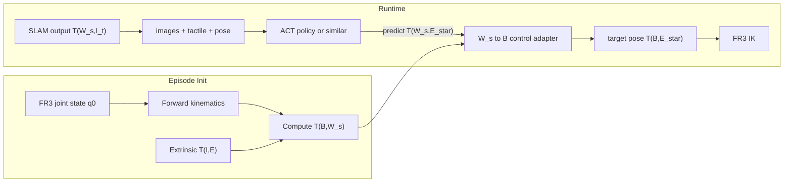

# Franka Research 3 DAS-Gripper SLAM Frame Contract

## Scope

This note fixes the frame semantics and data/control contracts for the planned
pipeline:

- DAS-gripper provides synchronized multi-view images, tactile signals, and SLAM
  poses.
- SLAM outputs `T(W_s, I_t)`.
- The learning target is `obs(images, ee pose, tactile, etc.) => action(ee pose)`.
- The current action label is defined as absolute end-effector pose in `W_s`.
- FR3 inverse kinematics requires the target pose in the FR3 base frame `B`.

This document does not implement the pipeline. It specifies what must be
defined, persisted, and validated before implementation starts.

## Goal

The immediate goal is to make the following unambiguous:

- what each frame means
- how to transform SLAM output into FR3 control targets
- what must be recorded at episode level and frame level
- how to initialize each episode
- how to validate that the frame chain is correct

## Coordinate Frames

The system uses the following frames:

| Symbol | Meaning |
| --- | --- |
| `B` | FR3 base frame |
| `E` | End-effector / TCP frame |
| `I` | DAS-gripper IMU body frame |
| `W_s` | SLAM world frame for the current episode |

`W_s` is defined as the IMU body frame at the first frame of the episode:

$$
W_s \equiv I_0
$$

This means `W_s` is episode-local, not globally stable across recordings.

## Transform Convention

The document uses the following convention:

$$
\mathbf{p}_A = T(A, B)\,\mathbf{p}_B
$$

That is, `T(A, B)` transforms a point expressed in frame `B` into frame `A`.

Under this convention:

- `T(W_s, I_t)` is the SLAM output at frame `t`
- `T(I, E)` is the rigid extrinsic from IMU body to end-effector
- `T(B, E_t)` is the end-effector pose in FR3 base coordinates

## Confirmed Inputs and Assumptions

The current planning assumptions are:

- SLAM directly outputs `T(W_s, I_t)`.
- Tactile, three-view images, and pose signals are already synchronized to the
  same frame timestamp.
- The policy action label is the absolute end-effector pose in `W_s`.
- FR3 joint state at episode start is available.
- FR3 forward kinematics can provide `T(B, E_0)`.
- The rigid extrinsic `T(I, E)` is known or will be calibrated.

## Core Transform Chain

### IMU pose to end-effector pose in SLAM world

Given the SLAM output and the IMU-to-EE extrinsic:

$$
T(W_s, E_t) = T(W_s, I_t)\,T(I, E)
$$

### Episode initialization transform

Because:

$$
W_s \equiv I_0
$$

we have:

$$
T(B, W_s) = T(B, I_0)
$$

At episode start:

$$
T(B, E_0) = T(B, I_0)\,T(I, E)
$$

Therefore:

$$
T(B, W_s) = T(B, E_0)\,T(E, I)
$$

where:

$$
T(E, I) = T(I, E)^{-1}
$$

### Runtime conversion to FR3 base frame

For any frame `t`:

$$
T(B, E_t) = T(B, W_s)\,T(W_s, I_t)\,T(I, E)
$$

If the policy predicts a target end-effector pose in `W_s`:

$$
\hat{T}(W_s, E_t^\star)
$$

then the online control adapter must convert it to FR3 base coordinates:

$$
\hat{T}(B, E_t^\star) = T(B, W_s)\,\hat{T}(W_s, E_t^\star)
$$

The result is then sent to the FR3 IK solver.

## Data and Control Architecture

## Training Contract

The observation may include:

$$
o_t = \{\text{images}_t,\ \text{tactile}_t,\ T(W_s, E_t),\ \ldots\}
$$

The current canonical action label is:

$$
a_t = T(W_s, E_t^\star)
$$

This contract is valid for training, but `a_t` is not directly usable by FR3
IK until converted through `T(B, W_s)`.

### Recommended derived label

Even if `action in W_s` remains the canonical supervision target, the dataset
should also export a derived base-frame label for debugging and ablation:

$$
a_t^{(B)} = T(B, W_s)\,a_t
$$

This is not a change of training definition. It is a derived field that makes
it easier to compare:

- training-time pose semantics
- replay-time pose semantics
- deployment-time IK targets

## Episode-Level Requirements

Each episode must persist the initialization data needed to reconstruct the
frame chain.

Required episode-level fields:

- `episode_id`
- `start_timestamp`
- `q_0`
- `T(B,E_0)` from FR3 forward kinematics
- `T(I,E)` extrinsic
- `T(B,W_s)`
- `robot_model_version`
- `extrinsic_calib_version`
- `slam_version`

If `T(B,W_s)` is missing, the episode is not deployable for FR3 IK control.

## Frame-Level Requirements

Each frame should record the synchronized sensor data plus the raw and derived
poses.

Required frame-level fields:

- `frame_index`
- `timestamp`
- `image_left`
- `image_right`
- `image_third`
- `tactile`
- `joint_state`
- `T(W_s,I_t)` raw SLAM output
- `T(W_s,E_t)` derived end-effector observation pose
- `action_pose_ws`

Strongly recommended derived fields:

- `T(B,E_t)`
- `action_pose_b`

Saving both raw and derived fields avoids re-deriving critical transforms in
multiple places with potentially inconsistent conventions.

## What Must Actually Be Completed

The following artifacts should be completed before implementation starts.

### 1. Coordinate frame and transform contract

Create a short design note that freezes:

- the meaning of `B`, `E`, `I`, and `W_s`
- the direction convention of `T(A, B)`
- the rotation representation used in storage and runtime
- the canonical definition of the end-effector frame

This is the top-level contract. All data writing, replay, training, and control
code must obey it.

### 2. Episode initialization specification

Define the exact procedure used at the beginning of every episode to compute:

$$
T(B, W_s)
$$

This procedure must specify:

- required inputs
- timing requirements
- FK dependency
- extrinsic dependency
- failure handling
- persistence format

### 3. Dataset field specification

Define the dataset schema for:

- raw SLAM poses
- derived end-effector poses
- canonical action labels in `W_s`
- optional derived action labels in `B`
- timestamps and synchronization assumptions

This schema should state, field by field:

- tensor layout
- frame semantics
- units
- rotation representation
- whether the field is recorded or derived

### 4. Online control adapter specification

Define the runtime adapter that converts:

$$
\hat{T}(W_s, E_t^\star) \rightarrow \hat{T}(B, E_t^\star)
$$

This spec should cover:

- required episode metadata
- exact transform chain
- numerical conventions
- error handling when metadata is missing
- interface to the FR3 IK solver

### 5. Validation and replay plan

Define the checks that prove the frame chain is correct.

Minimum checks:

- first-frame identity check for `T(W_s, I_0)`
- transform-chain consistency check
- replay check from logged `W_s` action to reconstructed `B` action
- FK comparison when joint state is available
- tolerance thresholds for translation and rotation errors

## Validation Checklist

The following checks should be treated as mandatory.

### First-frame check

At the beginning of each episode:

$$
T(W_s, I_0) \approx I
$$

where `I` is the identity transform up to numerical tolerance.

### Chain consistency check

For sampled frames, verify:

$$
T(B, E_t) = T(B, W_s)\,T(W_s, I_t)\,T(I, E)
$$

with a fixed and documented convention.

### Replay check

Given a logged `action_pose_ws`, reconstruct the base-frame target:

$$
T(B, E_t^\star) = T(B, W_s)\,T(W_s, E_t^\star)
$$

and verify that online replay yields the expected FR3 target pose.

### FK agreement check

When joint state is available for a logged frame, compare:

- `T(B,E_t)` from robot forward kinematics
- `T(B,E_t)` from the SLAM-plus-extrinsic chain

This will expose calibration drift or frame-direction mistakes quickly.

## Open Design Notes

The canonical training action remains absolute EE pose in `W_s`, because that
matches the current data definition. However, storing a derived `action_pose_b`
is still recommended for three reasons:

- easier deployment debugging
- easier replay validation
- easier ablation if a future experiment compares `W_s` labels with `B` labels

This document does not choose between training on `W_s` labels and training on
`B` labels. It only ensures that the system can support both without redefining
the raw recording contract.

## Immediate TODO

1. Freeze the transform notation and end-effector frame definition.
2. Freeze the calibration contract for `T(I,E)`.
3. Write the episode initialization procedure for `T(B,W_s)`.
4. Write the dataset field schema for raw and derived pose fields.
5. Write the runtime adapter spec from `W_s` action to `B` IK target.
6. Write the validation and replay test plan with tolerances.
