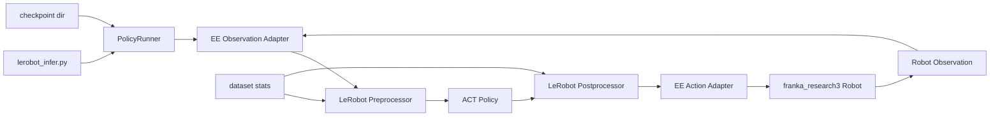
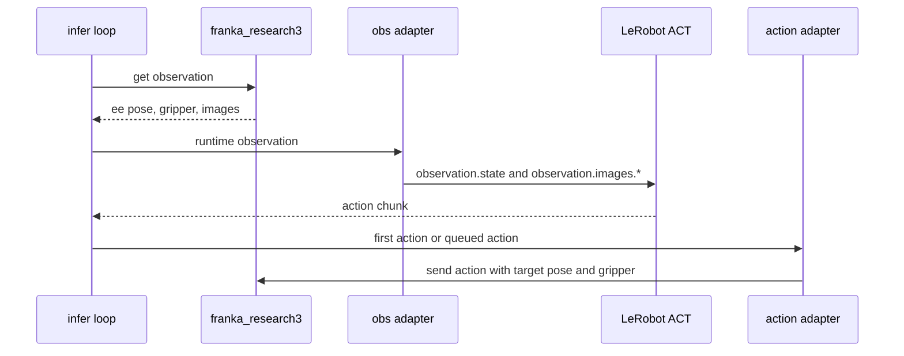
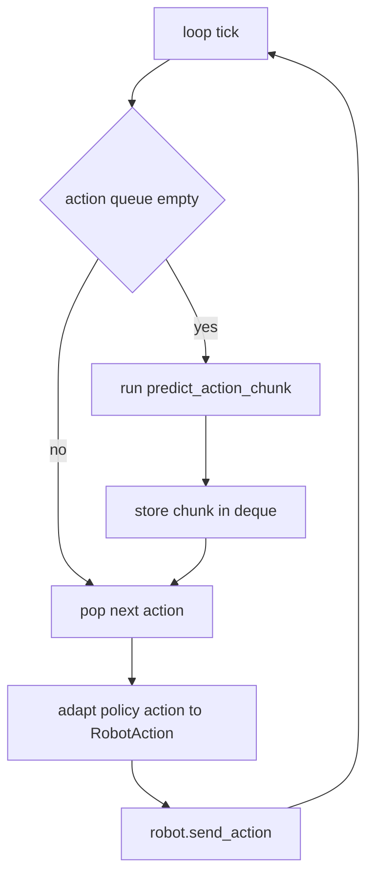

# Franka Research 3 EE2EE Inference Minimal Migration

## Scope

This note captures the current design decision for migrating the HIROL LeRobot
inference chain represented by:

- `/home/hanyu/Codes/HIROLRobotPlatform/factory/tasks/inferences_tasks/lerobot/inference.py`
- `/home/hanyu/Codes/HIROLRobotPlatform/factory/tasks/inferences_tasks/lerobot/config/act.yaml`

under the explicit assumption that the target policy path is `ee2ee`, not
`q2cq`.

## Primary Decision

For the first cut, the minimal migration should:

- keep LeRobot policy loading and inference logic
- keep LeRobot pre/post processors
- keep chunk-based execution
- drop HIROL `InferenceBase`
- drop HIROL `GymApi`
- drop HIROL `ActionAggregator`
- drop DAgger
- drop RTC
- drop latency compensation
- drop ROS2 bridge and online logging extras

In short:

- migrate the policy runner
- replace the execution shell
- preserve the robot-side LeRobot architecture

## What Is Actually Reused

The migration should directly reuse these LeRobot-facing ideas from HIROL
`inference.py`:

- resolve checkpoint directory
- load `PreTrainedConfig`
- load dataset metadata and stats
- instantiate policy with `make_policy`
- instantiate pre/post processors with `make_pre_post_processors`
- call `prepare_observation_for_inference`
- call `policy.predict_action_chunk`

The rest of the HIROL file is considered non-essential for v1.

## Runtime Architecture



## Step-Level Data Flow



## Chunk Execution Model



## Canonical Contracts

### Robot Canonical Observation

The robot should continue to expose the canonical runtime observation in
end-effector form:

```python
{
    "ee.x": float,
    "ee.y": float,
    "ee.z": float,
    "ee.wx": float,
    "ee.wy": float,
    "ee.wz": float,
    "gripper.pos": float,
    "observation.images.ee_cam_color": np.ndarray,
    "observation.images.third_person_cam_color": np.ndarray,
    "observation.images.side_cam_color": np.ndarray,
}
```

If a checkpoint expects quaternion orientation, conversion should happen inside
the observation adapter, not by changing the robot's canonical schema.

### Robot Canonical Action

The robot should continue to accept the canonical Cartesian action contract:

```python
{
    "enabled": bool,
    "target_x": float,
    "target_y": float,
    "target_z": float,
    "target_wx": float,
    "target_wy": float,
    "target_wz": float,
    "gripper": float,
}
```

If a checkpoint outputs quaternion orientation, conversion should happen inside
the action adapter before the command reaches the robot.

## Policy-Private Contracts

The checkpoint-specific contract is private to the inference adapters.

That means:

- `ee_observation_adapter.py` is responsible for producing the checkpoint's
  expected `observation.state`
- `ee_action_adapter.py` is responsible for decoding checkpoint action vectors
  into canonical `RobotAction`

The robot itself should not know whether the checkpoint used:

- rotvec
- quaternion
- euler
- another packed layout

## Minimal File List

### Entry and Config

- `src/lerobot/scripts/lerobot_infer.py`
- `src/lerobot/inference/config_infer.py`

### Core Runtime

- `src/lerobot/inference/policy_runner.py`
- `src/lerobot/inference/checkpoint_loader.py`
- `src/lerobot/inference/chunk_executor.py`

### Adapters

- `src/lerobot/inference/adapters/ee_observation_adapter.py`
- `src/lerobot/inference/adapters/ee_action_adapter.py`
- `src/lerobot/inference/adapters/__init__.py`

### Optional Project Docs and Sample Config

- `docs/franka_research3_ee2ee_inference.md`
- `src/lerobot/configs/franka_research3_ee2ee_act.yaml`

## Minimal Responsibilities

### `checkpoint_loader.py`

Responsible for:

- resolving the usable checkpoint directory
- loading `PreTrainedConfig`
- loading `LeRobotDatasetMetadata`
- loading pre/post processors
- exposing the policy input/output feature metadata

### `policy_runner.py`

Responsible for:

- owning the policy instance
- preparing observation tensors
- invoking `predict_action_chunk`
- invoking `select_action` when needed
- keeping device and processor state consistent

### `chunk_executor.py`

Responsible for:

- maintaining a local action deque
- refilling the deque when empty
- selecting the next action to execute
- not reimplementing HIROL's larger aggregation stack

### `ee_observation_adapter.py`

Responsible for:

- taking robot runtime observation
- validating required image keys
- assembling `observation.state`
- converting rotvec to quaternion if the checkpoint requires quaternion

### `ee_action_adapter.py`

Responsible for:

- decoding the postprocessed action vector
- mapping it into canonical Cartesian robot command
- converting quaternion to rotvec if the checkpoint emits quaternion
- producing a `RobotAction` dictionary for `franka_research3.send_action()`

## Explicit Non-Goals

Not part of v1:

- DAgger takeover
- teleop takeover arbitration
- RTC support
- latency compensation
- ROS2 marker bridge
- online rollout capture
- HIROL `InferenceBase`
- HIROL `GymApi`

## Final Recommendation

The smallest defensible `ee2ee` migration is:

- LeRobot-native policy runner
- LeRobot-native robot execution loop
- checkpoint-specific observation/action adapters
- canonical robot EE interfaces preserved
- no reuse of the HIROL inference shell

This keeps the policy side reusable while keeping the execution side aligned
with the current LeRobot architecture in this repository.
