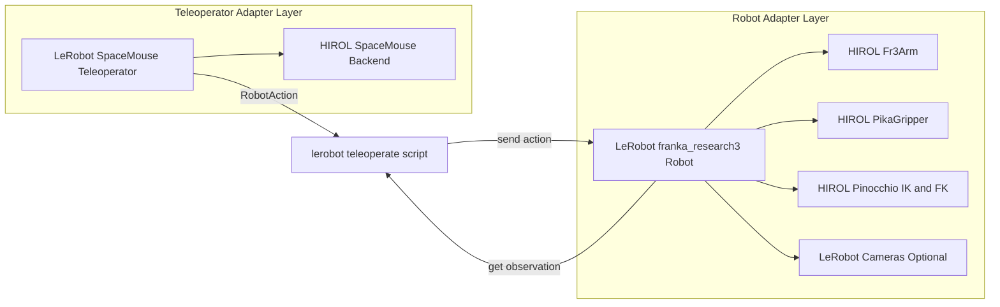
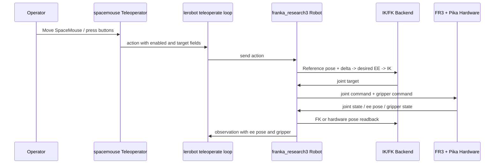
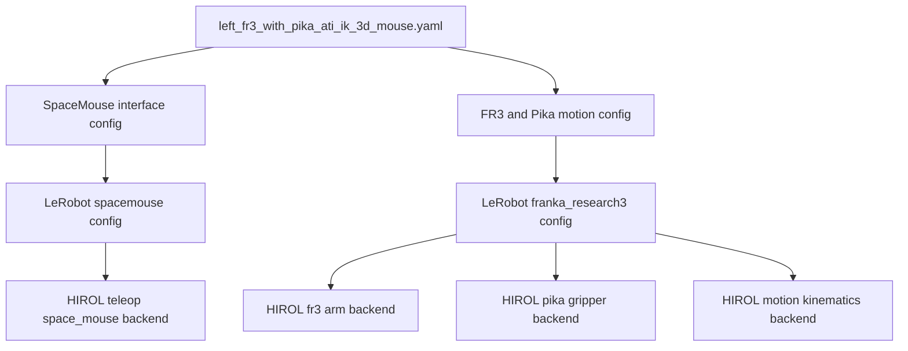

# Franka Research 3 Minimal Integration Notes

## Context

This note captures the current party-mode design discussion for adding a new
`franka_research3` robot under `src/lerobot/robots` with minimal integration
effort under the existing LeRobot architecture.

Source requirement discussed in the meeting:

- Add `franka_research3` under `src/lerobot/robots`.
- Support the HIROL teleop workflow represented by:
  - `/home/hanyu/Codes/HIROLRobotPlatform/teleop/teleoperation.py`
  - `/home/hanyu/Codes/HIROLRobotPlatform/teleop/config/left_fr3_with_pika_ati_ik_3d_mouse.yaml`
- Add `spacemouse` support under `src/lerobot/teleoperators`.
- Use LeRobot architecture as the primary structure.
- Do not prioritize HIROL factory-mode integration.
- Ignore latency compensation and DAgger for the first cut.

## Primary Decision

The recommended minimal integration is:

- Reuse HIROL device and kinematics backends.
- Keep orchestration inside LeRobot.
- Do not import or wrap HIROL `TeleoperationFactory`, `MotionFactory`, or
  `RobotFactory`.
- Add one thin `Robot` adapter and one thin `Teleoperator` adapter.
- Avoid custom processor wiring for the first cut.

This keeps the runtime model simple:

1. `lerobot_teleoperate.py` runs the outer loop.
2. `spacemouse` teleoperator emits robot-native Cartesian action commands.
3. `franka_research3` robot consumes those commands directly.
4. The robot adapter internally handles reference pose, workspace bounds, IK,
   and hardware writes.

## Why This Is the Smallest Viable Cut

LeRobot's current teleoperation loop uses identity processors by default, so
teleop output is forwarded directly to `robot.send_action()`. Because of that,
the cheapest path is not to add new processor stages, but to make the
teleoperator emit exactly the action structure the robot expects.

Relevant files:

- `src/lerobot/scripts/lerobot_teleoperate.py`
- `src/lerobot/teleoperators/teleoperator.py`
- `src/lerobot/robots/robot.py`

## Integration Shape

### Robot Adapter

Add a new package:

- `src/lerobot/robots/franka_research3/__init__.py`
- `src/lerobot/robots/franka_research3/config_franka_research3.py`
- `src/lerobot/robots/franka_research3/franka_research3.py`

The adapter should:

- Wrap HIROL `Fr3Arm`.
- Wrap HIROL `PikaGripper`.
- Optionally load existing LeRobot cameras from `config.cameras`.
- Internally load the FR3+Pika URDF model for IK.
- Expose LeRobot-compatible `observation_features` and `action_features`.

Recommended backend reuse:

- `/home/hanyu/Codes/HIROLRobotPlatform/hardware/fr3/fr3_arm.py`
- `/home/hanyu/Codes/HIROLRobotPlatform/hardware/tools/grippers/pika_gripper.py`
- `/home/hanyu/Codes/HIROLRobotPlatform/motion/kinematics.py`
- `/home/hanyu/Codes/HIROLRobotPlatform/motion/config/robot_model_fr3_pika_ati_cfg.yaml`

### Teleoperator Adapter

Add a new package:

- `src/lerobot/teleoperators/spacemouse/__init__.py`
- `src/lerobot/teleoperators/spacemouse/configuration_spacemouse.py`
- `src/lerobot/teleoperators/spacemouse/teleop_spacemouse.py`

The adapter should:

- Wrap HIROL `SpaceMouse`.
- Preserve HIROL axis mapping exactly.
- Parse relative 6-DoF pose deltas and gripper command.
- Emit action directly in `franka_research3` robot action format.

Recommended backend reuse:

- `/home/hanyu/Codes/HIROLRobotPlatform/teleop/space_mouse/space_mouse.py`

## Tightened Action Schema

Winston's tightened version is below. The goal is to remove ambiguous fields and
avoid unnecessary translation stages.

### Action Contract

`franka_research3.send_action()` should accept exactly:

```python
{
    "enabled": bool,
    "target_x": float,
    "target_y": float,
    "target_z": float,
    "target_wx": float,
    "target_wy": float,
    "target_wz": float,
    "gripper": float,
}
```

Field semantics:

- `enabled`
  - `True` when the SpaceMouse delta should update the Cartesian target.
  - `False` when the robot should keep the previous latched target.
- `target_x`, `target_y`, `target_z`
  - Relative translation deltas in meters in robot command frame.
- `target_wx`, `target_wy`, `target_wz`
  - Relative orientation delta as rotation vector in radians.
- `gripper`
  - Absolute normalized command in `[0.0, 1.0]`.
  - `0.0` means fully closed.
  - `1.0` means fully open.

Why `gripper` and not `gripper_vel`:

- HIROL `SpaceMouse` already maintains an internal absolute gripper command.
- `PikaGripper.set_hardware_command()` already consumes an absolute normalized
  target.
- Using `gripper_vel` in the first cut would force an extra accumulator layer in
  LeRobot for no gain.

### Teleoperator Output Rules

`spacemouse.get_action()` should:

- Call the HIROL relative parser.
- Keep the existing axis mapping from HIROL unchanged.
- Emit a full action every loop iteration.
- When no fresh motion is available:
  - return zero Cartesian deltas
  - set `enabled` to `False`
  - keep returning the latest `gripper` value

Canonical output example:

```python
{
    "enabled": success,
    "target_x": pose[0],
    "target_y": pose[1],
    "target_z": pose[2],
    "target_wx": pose[3],
    "target_wy": pose[4],
    "target_wz": pose[5],
    "gripper": tool[0],
}
```

## Tightened Observation Schema

The first cut should keep observations minimal, stable, and aligned with the
Cartesian teleoperation contract. For this reason, v1 should use an
end-effector-first observation schema.

### Required Observation Fields

```python
{
    "ee.x": float,
    "ee.y": float,
    "ee.z": float,
    "ee.wx": float,
    "ee.wy": float,
    "ee.wz": float,
    "gripper.pos": float,
}
```

Semantics:

- `ee.x`, `ee.y`, `ee.z`
  - Measured TCP position in meters.
- `ee.wx`, `ee.wy`, `ee.wz`
  - Measured TCP orientation as rotation vector in radians.
- `gripper.pos`
  - Measured Pika opening normalized to `[0.0, 1.0]`.

This makes the observation side match the control abstraction used by teleop:
Cartesian pose plus gripper state.

### Rotation Representation Decision

For v1, the recommended canonical EE orientation representation is rotation
vector, not quaternion.

Recommended canonical fields:

```python
"ee.wx", "ee.wy", "ee.wz"
```

Reasoning:

- The current LeRobot Cartesian teleop path already uses rotation vector for
  `target_wx`, `target_wy`, `target_wz`.
- Existing LeRobot kinematic processors also use `ee.wx`, `ee.wy`, `ee.wz`.
- Keeping action and observation in the same orientation representation reduces
  translation layers and naming churn.
- For learning and control, a 3D local orientation parameter is usually easier
  to consume than a 4D unit quaternion with normalization constraints.

Why not make quaternion the only v1 representation:

- Quaternion introduces unit-norm maintenance.
- Quaternion has sign ambiguity: `q` and `-q` encode the same pose.
- The current LeRobot codebase often converts quaternion observations into
  axis-angle / rotation-vector style representations before downstream use.

Recommended compromise:

- Keep rotation vector as the canonical schema in v1.
- If interoperability is needed, optionally expose:

```python
"ee.qx", "ee.qy", "ee.qz", "ee.qw"
```

Optional quaternion fields should be treated as secondary compatibility fields,
not the primary contract.

### Optional Observation Fields

These are allowed but should not block the first cut:

- `joint_1.pos` to `joint_7.pos`
- camera frames from LeRobot `config.cameras`
- ATI force-torque readings

### Explicitly Deferred in V1

Do not make these required for the first version:

- ATI force-torque observations
- latency compensation metadata
- DAgger or intervention-specific fields
- dataset-specific complementary info

## Robot Runtime Semantics

`franka_research3.send_action()` should behave as follows:

1. Read or reuse the current measured end-effector pose.
2. On `enabled=True` rising edge, latch the current pose as reference.
3. While `enabled=True`, compute:
   - `desired_position = reference_position + delta_position`
   - `desired_rotation = reference_rotation * delta_rotation`
4. While `enabled=False`, keep the last commanded Cartesian target stable.
5. Clip the target pose to a configured workspace box.
6. Solve IK for the FR3 arm joints.
7. Send joint targets to `Fr3Arm`.
8. Send normalized `gripper` to `PikaGripper`.

This keeps the high-level behavior close to current LeRobot Cartesian teleop
patterns without introducing extra processors.

To support the EE-based observation schema, the robot adapter should:

- read joint state from `Fr3Arm`
- compute measured TCP pose from FK or hardware pose API
- publish EE pose as the primary observation
- optionally attach joint observations as secondary fields

## Configuration Recommendations

Recommended `FrankaResearch3Config` fields:

```python
id: str | None
calibration_dir: Path | None
hirol_root: Path
teleop_profile_path: Path | None
fr3_config_path: Path | None
pika_config_path: Path | None
robot_model_config_path: Path | None
workspace_min: tuple[float, float, float]
workspace_max: tuple[float, float, float]
cameras: dict[str, CameraConfig]
disable_torque_on_disconnect: bool
```

Recommended `SpaceMouseTeleopConfig` fields:

```python
id: str | None
calibration_dir: Path | None
hirol_root: Path
teleop_profile_path: Path | None
interface_config_path: Path | None
mode: str = "relative"
```

Config loading rules:

- If `teleop_profile_path` is provided, parse
  `left_fr3_with_pika_ati_ik_3d_mouse.yaml`.
- Ignore latency-related keys in v1.
- Extract only:
  - motion-related hardware config paths for robot adapter
  - SpaceMouse interface config for teleoperator adapter

## Required Registration Changes

Add explicit imports to ensure `draccus` subclass registration is active in
entrypoints:

- `src/lerobot/scripts/lerobot_teleoperate.py`
- `src/lerobot/scripts/lerobot_record.py`
- likely also:
  - `src/lerobot/scripts/lerobot_calibrate.py`
  - `src/lerobot/scripts/lerobot_find_joint_limits.py`
  - `src/lerobot/scripts/lerobot_setup_motors.py`

## Initial Non-Goals

These are intentionally out of scope for the first cut:

- HIROL factory integration
- latency compensation
- DAgger / intervention logic
- ATI-based impedance or force feedback loop
- dual-arm support
- generalized processor pipeline for multiple Cartesian teleops

## Suggested Bring-Up Order

1. Add `spacemouse` teleoperator and validate raw action output.
2. Add `franka_research3` robot and validate observation readout.
3. Validate single-step Cartesian command to IK to joint write.
4. Run teleoperation loop at `100-200 Hz`, not `1000 Hz`.
5. Only after that, wire the same robot/teleop pair into dataset recording.

## Mermaid Diagrams

### Runtime Architecture



### Action and Observation Flow



### Configuration and Backend Reuse



## Final Recommendation

For this repository and this requirement set, the smallest defensible
integration is:

- thin LeRobot robot adapter
- thin LeRobot SpaceMouse adapter
- direct reuse of HIROL hardware and kinematics internals
- no factory reuse
- no latency / DAgger / ATI dependency in v1

That path minimizes code surface area while keeping the system aligned with the
existing LeRobot architecture.
