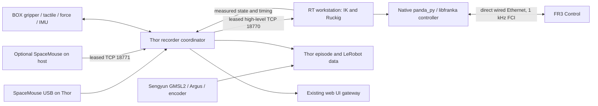

# FR3 teleoperation with the Thor collection box

`bash run/deploy.sh` now selects the FR3 + Thor configuration. It keeps the
existing Sengyun GMSL2 recorder, hardware trigger, online SOF synchronization,
camera preview, BOX sensors, calibration, task management, save/discard,
episode inspection, and export. The SpaceMouse can remain plugged into Thor.

## Architecture and FCI timing



The workstation runs the native C++ controller. TCP carries bounded Cartesian
deltas at up to 200 Hz and downsampled state; it does **not** forward FCI packets.
No browser, camera, BOX SDK, encoder, file writer, or Python network callback
runs inside the 1 kHz FCI callback. Thor owns one existing BOX SDK session;
gripper commands reuse its selected device handle instead of opening a second
client on UDP port 15000.

The new arm server requires `/sys/kernel/realtime=1`, scheduling permission for
`SCHED_FIFO`, working native dependencies, and explicitly constructs Panda
with `RealtimeConfig.kEnforce`. The old backend's default remains compatible
with existing workstation workflows. A single authenticated connection owns
the server session. Deltas are consumed once through a latest-command mailbox.

Each response grants a single-use command lease with a 150 ms deadline. Expired,
duplicate, malformed, nonfinite, or oversized commands end the session. Lost
Thor/host input, stale state, a frozen native robot clock, native controller
errors, or an FCI command success rate below 0.995 also stop control. Faults
require reconnecting; there is no automatic error recovery or motion restart.
On normal UI Stop, the arm holds and telemetry continues; on connection loss,
the workstation disconnects the controller. The gripper is seeded from its
fresh measured opening before switching to control mode and returns to
collection mode on Stop/fault/shutdown.

These software checks cannot guarantee that hardware/network communication
constraints will never be violated. Commission the direct FCI link with
`communication_test`, then repeat it and inspect telemetry under the intended
load. Do not increase watchdog limits to conceal a bad FCI link. Franka's
[system requirements](https://frankarobotics.github.io/docs/doc/libfranka/docs/system_requirements.html)
and [troubleshooting guide](https://frankarobotics.github.io/docs/troubleshooting.html)
describe the RT kernel, direct connection, latency, and communication test.

## Observed hardware status, 2026-10-02

- Thor `192.168.111.122` is aarch64, kernel `6.8.12-tegra`, with ordinary PREEMPT.
  It has no `/sys/kernel/realtime` marker and no installed `panda_py`/`franky`.
- The SpaceMouse Compact enumerates as `/dev/hidraw0` and
  `/dev/input/by-id/usb-3Dconnexion_SpaceMouse_Compact-event-if00`.
  A read-only open on Thor succeeded using its existing sudo access. The idle
  device produced no report during the two-second observation.
- A temporary aarch64 environment with **pyspacemouse 2.1.0** and the extracted
  Ubuntu hidapi library successfully enumerated `SpaceMouseCompact`, opened it,
  and read six zero-valued axes and both released buttons. This directly verifies
  the Python driver on Thor. No application/system packages were installed by
  the test; the temporary environment was removed.
- `/dev/hidraw0` was root-owned, mode 0600. The `nvidia` account could not open
  it normally, and Thor's application venv did not contain `pyspacemouse`.
  Run the setup below before using teleoperation; axis directions and button
  response still need the component check with the puck moved by the operator.
- SSH to the existing workstation `hph@192.168.100.155` failed authentication.
  Its RT kernel, FR3 link, native environment, and robot motion remain
  **unverified**. No live FR3 controller or camera/BOX session was started by
  this development validation.

## Configuration and one-time setup

The complete rig configuration is
`tools/thor/gmsl2/thor_fr3_teleop.yaml`. Its camera/BOX settings copy the current
production configuration. Future rig-specific camera changes should be applied
to the selected configuration as well.

| Item | Default |
| --- | --- |
| Thor SSH / gateway | `nvidia@192.168.111.122`, HTTP `8765` |
| Arm workstation SSH | `hph@192.168.100.155` |
| FR3 Control IP | `192.168.1.206` |
| Arm bridge | workstation TCP `18770` |
| Optional host input | Thor TCP `18771` |
| Gripper model / TCP | Corenetic BOX gripper / `corenetic_gripper_ee` |
| Selected BOX | `fr3_teleop.gripper_box_id`; empty requires exactly one BOX |
| Gripper full opening | `0.09 m`, normalized command range `0..1` |
| Arm delta limits | `1 mm` per axis and `0.01 rad` per axis per command |

Confirm the IP, mounted gripper, URDF, TCP, workspace, opening range, and BOX ID
before motion. Different SSH addresses/checkout paths must also be reflected
in `run/deploy.sh`, `run/sync_to_target.sh`, and `run/prepare_fr3_bridge.sh`.
The bridge credentials are generated in `outputs/.fr3_bridge_token` and copied
with mode 0600 to both targets; they are excluded from repository sync.
Use these TCP channels on the trusted rig LAN; the application token does not
encrypt transport.

On Thor, after code sync:

```bash
cd /home/nvidia/lerobot
bash run/setup_thor_spacemouse.sh
# Log out/in, then replug the SpaceMouse.
PYTHONPATH=src:. .venv/bin/python -m tools.fr3.check_box_teleop spacemouse --duration-s 10
```

The script installs the verified `pyspacemouse==2.1.0`, draccus, Hugging Face
Hub utilities, numpy, and hidapi libraries and configures
udev/plugdev access for the supported vendor IDs. It does not connect to FR3.
The shared Teleoperator base loads motor-calibration dependencies only when
reading a calibration file; SpaceMouse does not need Torch/training packages
in the Thor collection environment.
Keep the puck released during startup bias calibration. The existing axis
mapping is retained: translation `[-raw_y, raw_x, raw_z]`, body-frame rotation,
and the existing incremental gripper buttons. Motion is enabled by puck motion
after UI Start; `teleop.motion_enable_button` can select a held button if needed.

On the workstation, establish SSH access from the deployment host, install a
PREEMPT_RT kernel and configure the operator's RT priority/memlock permissions
according to Franka's requirements. Reboot into that kernel and refresh the
login session. Install the existing native environment if absent:

```bash
cd /home/hph/Code/lerobot
bash tools/fr3/setup_workstation_teleop_env.sh
export PYTHONPATH=src:.
export LD_LIBRARY_PATH="$(.venv-fr3/bin/python -c 'import site; from pathlib import Path; print(":".join(str(Path(p)/"cmeel.prefix/lib") for p in site.getsitepackages()))'):${LD_LIBRARY_PATH:-}"
.venv-fr3/bin/python -m tools.fr3.check_box_teleop rt
# With the robot prepared for FCI, run the installed libfranka example:
communication_test 192.168.1.206
```

The RT component check only inspects kernel/scheduler/dependencies; it does not
open FCI. `communication_test` does open a robot control session, so run it with
the operator present and no other FCI owner. Preserve its results when
commissioning. The server also checks live native controller errors/success
rate; a successful preflight alone does not establish network quality.

## Deploy and use the UI

On the development host:

```bash
bash run/deploy.sh                     # Thor USB input + workstation FCI + local UI
bash run/deploy.sh thor --no-frontend   # same services, no local Vite UI
bash run/deploy.sh --box-only           # original camera/BOX-only workflow
bash run/deploy.sh workstation          # existing workstation + RealSense workflow
```

Deployment syncs Thor, syncs/preflights the arm workstation, provisions the
shared token, starts the arm listener, restarts the Thor gateway, and opens the
existing frontend at `http://localhost:5173/` (Vite may choose a free next port).
An RT/dependency/SSH failure stops deployment before restarting the gateway.
Starting the listener does not connect to FR3. **Live Record → Connect** opens
the camera/BOX session and the workstation controller, initially holding.

1. Open **Live Record**, select the task/dataset and press **Connect**.
2. Open **Teleoperation**. Confirm measured joints, torques, task TCP, external
   wrench, bridge latency/clock uncertainty, tactile pads, and BOX force.
3. Press **Start Real Robot Teleop**. Move the puck gently and test its two
   gripper buttons. The gripper starts from the measured opening.
4. Use **Live Record → Start Episode**, then **Save** or **Discard**. Recording
   and teleoperation have separate lifecycles; Save does not stop teleoperation.
5. Use **Stop Teleop** to hold while keeping sensor/arm telemetry connected.
   Disconnect the collection session to release FCI completely.

Calibration captures keep their existing redirected roots and can run while
FR3 is unavailable. Task captures in this configuration require FR3 telemetry;
an arm fault discards the active episode. Use `--box-only` for camera-only or
BOX-only task recordings. Hardware replay from this Thor gateway is refused
because it would bypass the dedicated RT arm owner; use the separate
workstation replay workflow. Visual episode replay and dataset export remain
available.

For host-connected SpaceMouse input:

```bash
bash run/deploy.sh --spacemouse-host
# In the UI, Connect first; then run this in another host terminal:
PYTHONPATH=src:. .venv/bin/python -m tools.fr3.box_spacemouse_sender
# Finally press Start Real Robot Teleop in the UI.
```

Install the same SpaceMouse dependencies/device permissions on the host if
needed. The sender gets the gripper baseline and session generation from Thor;
it cannot enable the arm by itself. Losing the sender stops teleoperation.
Restart/reconnect explicitly after a fault.

## Data contract

Each saved episode keeps camera MKVs, online-sync metadata, `box_sensors.jsonl`
with full tactile/force samples, and adds `fr3_state.jsonl`. The latter contains
coherent native q/dq/torque/pose/wrench, the native robot clock, applied/input
commands, source/receive timestamps, and clock uncertainty.
The source monotonic timestamp is taken when the workstation copies the native
state cache; it includes the native-to-host transport delay. It is not a
hardware exposure timestamp, and the native robot clock is retained separately.

The live session parquet retains the existing BOX `observation.state` and
`box.timestamps`, adding:

- `observation.fr3.q`, `.dq`, `.tau_J`, `.tau_ext_hat_filtered`: seven joint values.
- `observation.fr3.O_T_EE`: native flange pose, **column-major**, not the task TCP.
- `observation.fr3.tcp`: measured URDF task TCP as xyz + rotation vector.
- `observation.fr3.O_F_ext_hat_K`: estimated external wrench in native Franka semantics.
- `action`: commanded task TCP xyz + rotation vector + normalized gripper opening.
- `fr3.timestamps`: source monotonic, mapped Thor monotonic, receive monotonic,
  and clock uncertainty, all seconds.
- `fr3.valid`, `fr3.action_valid`, `fr3.control_command_success_rate`.

State is measured; `action` is the requested pose, before physical tracking and
gripper travel have completed. The normalized gripper action is not a force
command. Actual BOX distance, touch, and 6D force remain separate observations.

Each TCP exchange measures the clock offset by midpoint and bounds its
uncertainty by half the transport round trip after subtracting server handling
time. Samples align to the existing camera exposure timestamps in Thor's
monotonic clock. Native state polling is 200 Hz; recording is 60 Hz. This is
not hardware synchronization between the robot and cameras.

A frame is invalid when capture time is absent or alignment skew plus clock
uncertainty exceeds 25 ms. Invalid FR3 vectors use zeros with `fr3.valid=0`;
consumers must use the validity columns instead of treating zeros as readings.
Missing commands likewise use `fr3.action_valid=0`. Export preserves these
columns and the real FR3 action together with videos, full tactile arrays, BOX
state, and existing tracking sidecars. Mixed BOX-only/FR3 exports are rejected.

## Component tests and commissioning

Run automated checks on the development host:

```bash
PYTHONPATH=src:. .venv/bin/python -m tools.fr3.check_box_teleop config
PYTHONPATH=src:. .venv/bin/python -m pytest \
  tests/scripts/test_box_fr3_teleop.py tests/scripts/test_thor_export_v3.py \
  tests/scripts/test_thor_record_stdin.py tests/scripts/test_thor_record_meta.py \
  tests/scripts/test_thor_lerobot_v3_pts.py tests/scripts/test_data_collection_gui_gateway.py \
  tests/teleoperators/test_spacemouse.py tests/robots/test_franka_research3.py -q
cd tools/data_collection_gui/frontend
npm test
npm run build
```

These tests use fake robots. Localhost sockets must be permitted for the
bridge/gateway tests. Hardware tests are separate:

| Component | Check | Passing evidence |
| --- | --- | --- |
| SpaceMouse | `check_box_teleop spacemouse --duration-s 10` on its USB host | Open succeeds as operator; six axes and both buttons respond |
| RT host | `check_box_teleop rt` | RT kernel, SCHED_FIFO permission, native imports pass |
| FCI network | `communication_test <robot_ip>` on dedicated workstation | Communication results meet Franka requirements under load |
| Sengyun | Existing `recover_argus.sh`, then UI Connect/short recording | Detected cameras preview; online full-cluster sync manifest passes |
| BOX | UI Device Manager/live sensor cards | Distance/touch/force advance; expected rates remain healthy in control mode |
| Gripper | Start at mid-opening, then small button commands | No startup close/open jump; measured distance follows; Stop restores mode 0 |
| Combined recording | Save a 5–10 s episode, inspect/replay/export | Videos/tactile/force present; FR3 torque columns and validity present |
| Link failure | Stop sender or disconnect bridge during a supervised trial | Motion stops, UI faults, active task episode discarded, no auto-resume |
| Load | Record all required cameras with UI previews and BOX sensors active | FCI success stays above configured floor; no communication violations |

Check `outputs/logs/fr3_box_arm_server.log` on the workstation, and the existing
gateway/recorder logs under `outputs/logs/data_collection_gui` on Thor.
`FR3_LIVE` errors explain lease, native, state age, clock, or gripper failures.
The current BOX stream expectations remain gripper 120 Hz, force 480 Hz, IMU
240 Hz, and tactile 60 Hz per pad. Validate these after entering mode 1 as
well as in collection mode; firmware behavior has not been verified here.

Development validation completed: **556 Python tests passed, one skipped;
212 frontend tests passed; frontend production build, shipped config, shell
syntax, and patch whitespace checks passed.** The Python bridge tests use fake
robots; these results do not qualify the actual FR3 communication link.
