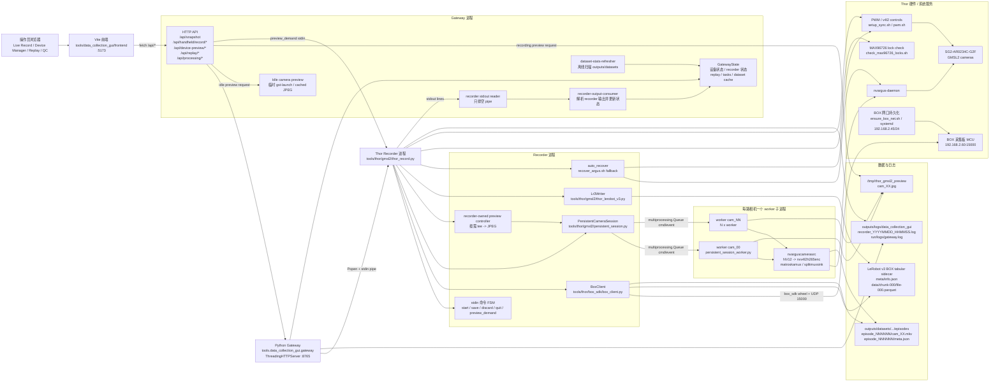
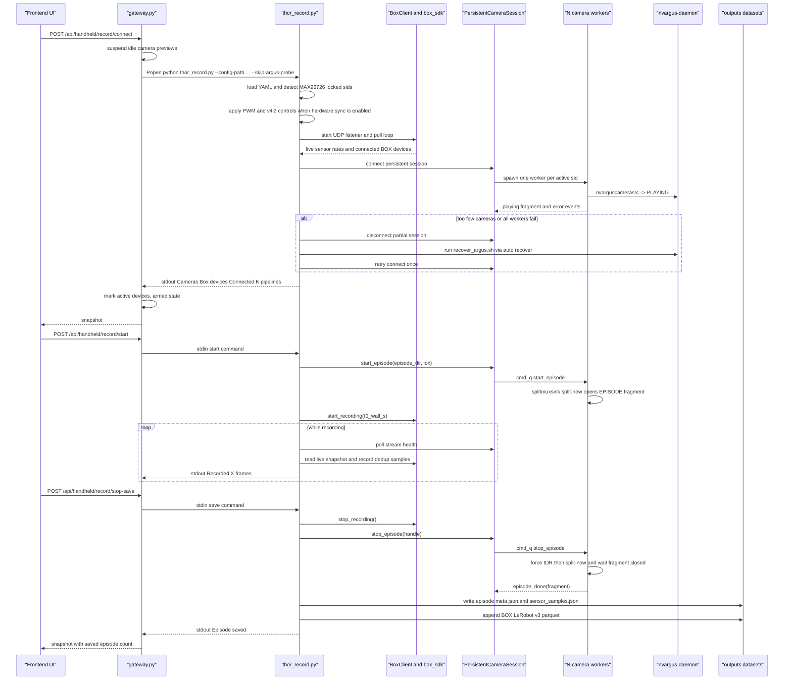
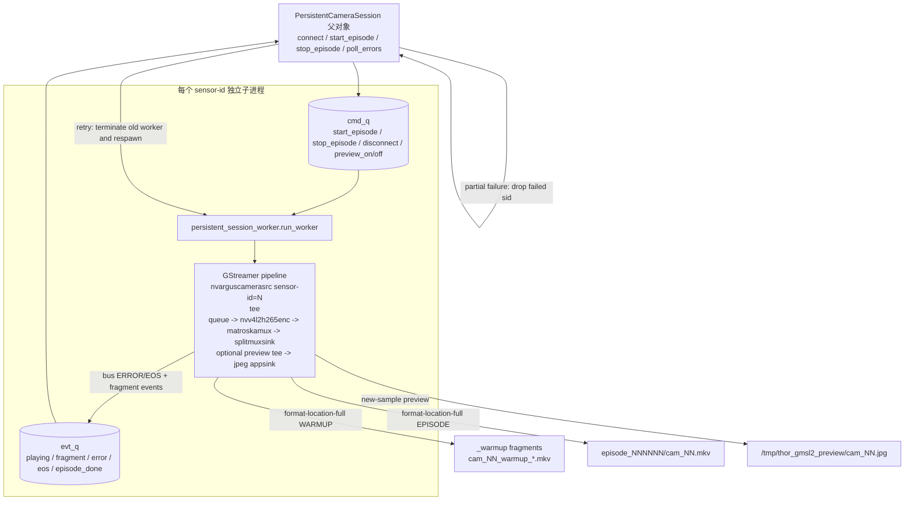
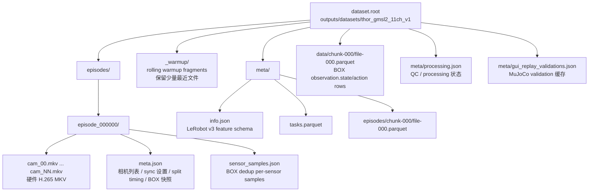
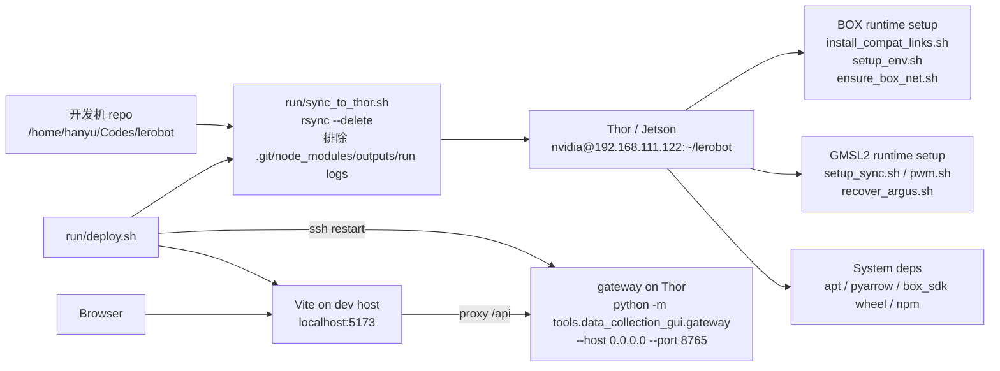
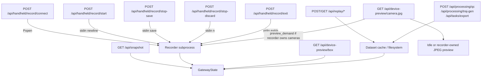
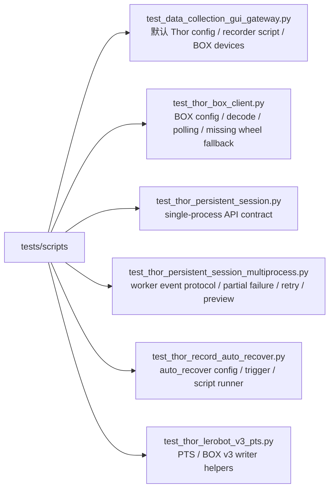

# Thor 数据采集全局软件架构

本文以 `tools/thor/DEPLOYMENT.md` 为入口，并按当前代码实现梳理 Thor / Jetson
数据采集链路。核心系统是 `tools/data_collection_gui` 前端 + Python gateway，
由 gateway 启动 `tools/thor/gmsl2/thor_record.py`，再由 recorder 协调 11 路
GMSL2 相机、BOX 采集板、预览、自动恢复和数据集写入。

## 1. 运行时总览

## 2. 组件职责

| 层级 | 代码入口 | 职责 |
| --- | --- | --- |
| 前端 | `tools/data_collection_gui/frontend/src/App.tsx`, `api.ts` | 轮询 `/api/snapshot`，发起 Connect/Start/Save/Discard/Replay/QC 请求，显示设备、预览、日志和数据集状态。 |
| Gateway | `tools/data_collection_gui/gateway.py` | 单机 HTTP API、全局状态机、启动/停止 recorder、解析 recorder stdout、维护设备状态、缓存数据集扫描、提供相机/BOX 预览和 Replay/QC/任务导出入口。 |
| Recorder | `tools/thor/gmsl2/thor_record.py` | Thor 采集主编排：读 YAML、检测相机、配置硬同步、启动 BOX、连接持久相机 session、处理 stdin 命令、保存/丢弃 episode、写 meta 和 BOX v3 sidecar。 |
| GMSL2 session | `persistent_session.py`, `persistent_session_worker.py` | 每路相机一个 worker 子进程；父进程只做控制和错误聚合；worker 内持久 GStreamer pipeline，用 `splitmuxsink split-now` 切 episode。 |
| BOX 适配 | `tools/thor/box_sdk/box_client.py` | 包装 vendored `box_sdk` wheel，配置 UDP，轮询 `SensorCache`，解码 gripper/IMU/trigger/force/touch，支持 live preview 和 episode 样本记录。 |
| 数据写入 | `thor_lerobot_v3.py` | 将 BOX 快照/样本写成轻量 LeRobot v3 parquet；相机视频保持硬编码 MKV，不把像素拉进 Python。 |
| 恢复/部署 | `recover_argus.sh`, `setup_sync.sh`, `ensure_box_net.sh`, `run/deploy.sh` | Argus/模块/PWM 恢复，BOX 网口持久化，本地到 Thor 的 rsync + gateway 重启 + Vite 启动。 |

## 3. Connect 与录制时序

## 4. GMSL2 worker 隔离模型

设计要点：

- GStreamer pipeline 在 Connect 时创建一次，episode 之间保持 warmup 状态，避免每个 StartEpisode 重建 11 路 `nvarguscamerasrc`。
- 一路相机一个 worker，避免单进程持有多个 Argus `CaptureSession` 时一处 `set_state(PLAYING)` 死锁拖死全部相机。
- `splitmuxsink` 的 `format-location-full` 决定 warmup 或 episode 文件名；Stop 时等待 `splitmuxsink-fragment-closed`，减少尾部丢帧和空目录。
- Connect 支持 partial failure：失败 sid 从 active stream 中移除，成功相机继续录制；全部失败才让 recorder 退出。
- recorder-owned preview 是录制 pipeline 的 tee 分支，按 `preview_demand` 心跳启停，避免 Device Manager 再打开第二个 Argus client 抢同一 sensor。

## 5. 数据输出结构

数据契约：

- 相机视频为每路每 episode 一个 MKV，像素不进入 Python；Python 只控制 pipeline 和写元数据。
- `meta.json` 记录 active camera、locked/failed sid、硬同步、split 时间、PTS offset、BOX 快照等采集上下文。
- `Lr3Writer` 将 BOX 状态压成 LeRobot v3 tabular sidecar，供 GUI replay/QC 读取 `observation.state` / `action`。
- gateway 的数据集扫描在后台线程做，`/api/snapshot` 只读缓存，避免大目录扫描卡住 recorder stdout 和 preview 请求。

## 6. 部署与恢复拓扑

部署清单中的关键运行约束：

- Gateway 启动前需要 `ensure_box_net.sh` 保证 `enP2p1s0` 上有 `192.168.2.45/24`，BOX MCU 固定向 `192.168.2.45:15000` 推送 UDP。
- BOX wheel 的 native `.so` 依赖旧 soname，首次部署需跑 `install_compat_links.sh` 并安装 Boost / URDF / tinyxml2 兼容依赖。
- `BoxClient.start()` 会自动设置 `BOX_SDK_URDF`；`LD_LIBRARY_PATH` 仍由 `setup_env.sh` 或启动 wrapper 提供。
- GMSL2 硬同步依赖 passwordless `sudo` 调 `pwm.sh` / `v4l2-ctl`；`auto_recover` 会在 Connect 失败或成功率过低时调用 `recover_argus.sh`。
- SSH 后台启动 gateway 使用 `setsid ... </dev/null >log 2>&1 &; disown`，避免 SSH 退出导致进程收到异常退出。

## 7. 主要 API 与状态流

状态更新不是靠 recorder RPC 返回，而是靠 stdout 协议：

- `Cameras: ...` / `Cameras (active): ...` 更新相机设备状态。
- `Box devices: ...` / `Box rates: ...` 更新 BOX 设备状态。
- `Connected K pipelines...` 将 recording 状态推进到可 start。
- `Recorded X frames...` 更新进度。
- `WARNING:` / `ERROR:` 进入前端日志并标记失败设备。
- `Episode saved.` / `Episode discarded` 更新 episode 计数和 UI 状态。

## 8. 测试覆盖边界

这些测试主要覆盖纯 Python 协议、状态机和数据契约；真实 Argus、GStreamer、PWM、
BOX UDP 和 11 路外场稳定性仍依赖 Thor 上按 `DEPLOYMENT.md` 执行的自检与外场验证。
