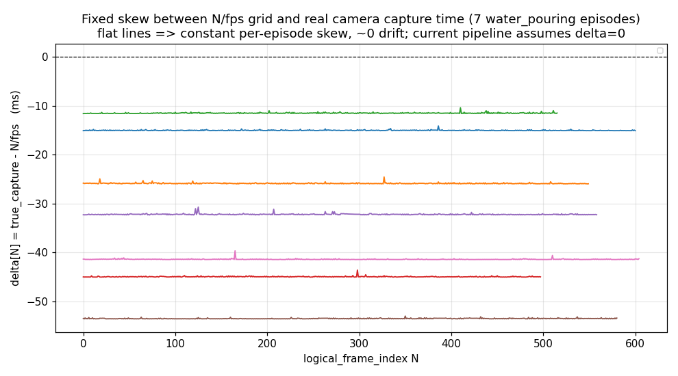

# 实验报告：BOX↔相机固定 skew 的量化与修正

> 日期 2026-07-16 · 数据 `nvidia@192.168.111.122:/home/nvidia/lerobot/outputs/datasets/water_pouring_20260715_*`
> 关联文档 [`../../ts_sync.md`](../../ts_sync.md) §5.1.1 / §5.4 / §10；代码 `gmsl2/thor_lerobot_v3.py::camera_frame_times_rel` / `_build_episode_rows`

## 0. 结论（TL;DR）

- **相机侧帧网格没问题**：实测 PWM 真实帧率 = 60.000 ± 0.002 fps，SOF 抖动 ~4µs，`N/fps` 相对硬件 SOF 采集时刻的漂移 ≤ 0.07ms/10s。→ 「频率漂移」担忧在 ~10s episode 上**可忽略,被证伪**。
- **真正的问题是固定 skew δ**：`N/fps` 网格与相机硬件 SOF 采集时刻之间存在 **−11 ~ −53ms 的偏移,且逐 episode 变化**（同一 session 内也跳）。当前流水线给图像第 N 帧配的 BOX state 系统性地晚 11–53ms。
- **实测危害**：把 BOX 按硬件 SOF 采集时刻重新对齐,配到每帧的 state 相对现法变化——gripper 距离 RMS 0.3–1.4mm / 单帧最大 **9mm**,6D 力 fz RMS 0.2–0.9N / 最大 **4.2N**,touch fz 最大 **24.7N**。误差随 |δ| 单调增长。
- **已修**：BOX 最近邻对齐目标从理想 `N/fps` 改为硬件 SOF 采集时刻 `sensor_timestamp_ns/1e9 − t0_mono_s`（sidecar 已有此数据,纯后处理,不动 loader 的 `i/fps` 共享网格）。
- **修复效果（量化）**：逐 episode 的 11–53ms 系统性 skew 被基本消除（→ ~0）。结合 §4 实测 skew 与 §5.4 既有量化/残差口径估算,BOX↔相机总时间对齐误差:
  - **199Hz gripper/6D 力**:约 15–59ms → 约 **4–6ms**（残余 = ±2.5ms 最近邻量化 + ~1–3ms 校准残差）,最差 episode 改善约 **90%**;
  - **50Hz touch**:降至约 **11–13ms**（主导仍是 ±10ms 最近邻量化）,改善约 **40–80%**。
  - state 层面消除的误差:gripper RMS 0.3–1.4mm、6D 力 RMS 0.2–0.9N、touch RMS 0.7–2.7N,单帧峰值分别达 **9mm / 4.2N / 24.7N**;102205/ep0 约 **25%** 的帧改变了 gripper 最近邻样本选择。
  > 注:总时间误差的「量化/残差」部分沿用 §5.4 既有口径,非本实验单独测得;本实验直接测得的是 skew 与 state 误差。

## 1. 背景与问题

`ts_sync.md` §6 说明:BOX↔相机对齐是在每个 60Hz 相机 logical frame 上对每个传感器做最近邻。代码 `_build_episode_rows` 里帧时间用的是理想 `timestamp = N/fps`（`frame_origin_s=0`），并**丢弃**了 recorder 已经采到的每帧 `sensor_timestamp_ns`（只把它当 encoder 前 gate 用）。

问题:相机帧 0 的硬件帧时间戳（SOF）并不等于 BOX 的 `t0`。**frame 0 的编号由软件 gate 与管线到达时序决定,而其硬件采集时刻可能早于 `t0`**——物理过程是:相机曝光 → 帧进入 ISP/VI/软件管线 → START/gate 判定 → 该帧被保留并编号为 0;因此 frame 0 虽在软件上于 START 后才被接收/保留,其曝光却可能发生在 START（`t0` 锁存）之前。管线缓存深度与启动相位逐次不同 → frame 0 相对 `t0` 呈现一个**逐 episode 变化的固定相位偏移**,且实测为负(§4:frame 0 SOF 早于 `t0`,与该解释符号一致)。这正是 §5.4 / TODO P1 说的「固定 skew」。

> 注:`online_sync_manifest.json` 的 `dropped_clusters_before_start` 计的是 START 边界附近被丢弃的 cluster 数,不能直接解释 δ 的符号;δ 的权威量化来自每帧 `sensor_timestamp_ns` 本身（§4）。修复不依赖对成因的精确归因。

## 2. 方法

数据:3 个数据集共 **7 条 episode**（`water_pouring_20260715_085801/094641/102205`）。每条 episode 用到的轻量文件（不含 mkv/mp4）:
`cam_*.argus_frame_metadata.csv`（含 `logical_frame_index,sensor_timestamp_ns,sof_tsc_ns,...`）、`online_sync_manifest.json`、`meta.json`（`sync_reference.t0_wall_s/t0_mono_s`）、`box_sensors.jsonl`（原始 BOX 样本 `mcu_ts,wall_s,t_rel_s,data`）。

**术语**:下文的「相机硬件采集时刻」= `sensor_timestamp_ns`（Argus/V4L2 `getSensorTimestamp`），它提供一个**与曝光高度相关的相机硬件帧时间锚点（start-of-frame / SOF）**——**不**主张它就是 exposure start 或 exposure midpoint。全局快门下 SOF 与真实曝光中心通常只差一个**固定** offset（几 ms 量级），因是常量,不影响本文要修的**逐 episode 变化**的 skew;待将来用 LED/闪光事件标定后可把该固定 offset 也校进去。除非确证该字段对应 exposure start/midpoint,否则一律按「硬件帧时间戳 / SOF 锚点」表述,不写「真实曝光时刻」。

**时钟域关系（关键前提,已验证）**:
- `sensor_timestamp_ns`（内核 SOF 戳,CLOCK_MONOTONIC）与 `time.monotonic()`（→ `t0_mono_s`）**同域**：实测 frame0 `sensor_timestamp/1e9 = 6782.931s` 与 `t0_mono_s = 6782.985s` 仅差 53ms。
- `sof_tsc_ns`（6809.5s）是**另一个 TSC 域**（差 ~26.6s），是跨*相机*同步键,**不能**当主机时钟锚点。
- BOX `t_rel = wall − t0_wall`（REALTIME）与相机 `sensor_timestamp − t0_mono`（MONOTONIC）共享同一原点（`t0_wall`/`t0_mono` 在 `start_episode` 背靠背采集,两钟频率一致）。

因此相机帧硬件 SOF 采集时刻可直接换算进 BOX 时钟:`δ[N] = (sensor_timestamp_ns[N]/1e9 − t0_mono_s) − N/fps`。

脚本:`analyze.py`（实验 A/B）、`impact.py`（实验 C）、`crosscheck_plot.py`（独立交叉验证 + 出图）、`validate_fix.py`（用生产函数在真机数据上验证修复）。
> 脚本内数据根路径为运行时的 scratchpad（下载的轻量文件副本）；复现时把 `ROOT/EP` 指向本地下载目录即可。

## 3. 实验 A — 相机侧（PWM 真实帧率 / `N/fps` 漂移）

对每路 `cam_XX.argus_frame_metadata.csv` 拟合 `sof_tsc_ns = a·N + b`:

| 项 | 实测 |
|---|---|
| 真实帧率（SOF） | 59.9988 – 60.0016 fps |
| PWM 抖动（SOF 残差 std） | ~4µs（一条 outlier 13.7µs） |
| 8 路 SOF slope 一致性 | 6 ns/frame → 确认同一 PWM |
| `N/fps` 漂移（δ 斜率） | 0.001–0.007 ms/s ≈ 0.01–0.07ms/10s |

**结论**:cam↔cam 硬同步与帧网格线性度都没问题;漂移在 10s 尺度可忽略。

## 4. 实验 B — 固定 skew δ（核心发现）

| episode | frames | δ 均值(ms) | δ 漂移(ms/s) | δ 跨度(ms) |
|---|---|---|---|---|
| 085801/ep0 | 601 | **−15.0** | −0.003 | 1.0 |
| 085801/ep1 | 550 | **−25.9** | −0.007 | 1.4 |
| 085801/ep2 | 516 | **−11.5** | +0.006 | 1.2 |
| 094641/ep0 | 498 | **−44.9** | −0.001 | 1.5 |
| 094641/ep1 | 559 | **−32.2** | −0.006 | 1.6 |
| 102205/ep0 | 581 | **−53.5** | +0.006 | 0.6 |
| 102205/ep1 | 605 | **−41.4** | −0.003 | 1.8 |

δ = **−11 ~ −53ms,逐 episode 变化**（同一 session 内也跳）,几乎零漂移（见 `skew_delta.png`:7 条平直水平线,各叠 ~1ms 抖动）。含义:图像第 N 帧配到的 BOX state 系统性晚 11–53ms。

修正方案的取舍:因 δ **逐 episode 变化**,**不能用一个全局常数 offset**。由于单条 episode 内 δ 近似常数、漂移极小,理论上也可用**每 episode 一个 offset**（`t_N = N/fps + δ̂_episode`）。但既然逐帧 `sensor_timestamp` 已在 sidecar 里,**直接用逐帧值最稳健**——它还能吸收那 ~1ms 的帧内抖动。故本修复优先用逐帧 SOF;sidecar 不完整时退化为**每 episode 线性拟合(offset+slope)外推**,而非退回全局固定 offset 或 `N/fps`（见 §6）。



**独立交叉验证**（排除时钟域假象）:把相机 frame0 的硬件 SOF 采集时刻换算成 REALTIME 纪元,和 BOX **自己的**第一条 `wall_s` 直接比:

| episode | δ (mono-relative) | cam0_realtime − box0_wall |
|---|---|---|
| 085801/ep0 | −15.1 | −15.6 |
| 094641/ep0 | −45.0 | −46.8 |
| 102205/ep0 | −53.5 | −55.6 |

两条完全独立的时钟路径给出同一个 δ（残差几 ms 来自 BOX 首样本本身不在 t0）→ δ 是真实物理 skew,不是算错域。

## 5. 实验 C — 注入的 state 误差

把 BOX 分别按 `N/fps`（现法）与 `sensor_timestamp − t0_mono`（提议）对齐,比较配到每帧的 state 值:

| episode | δ(ms) | gripper 距离 RMS/max | 6D 力 fz RMS/max | touch fz RMS/max |
|---|---|---|---|---|
| 085801/ep0 | −15 | 0.36 / 2.57 mm | 0.21 / 0.97 N | 0.7 / 10.2 N |
| 085801/ep2 | −11 | 0.31 / 2.39 mm | 0.16 / 0.73 N | 0.9 / 14.3 N |
| 094641/ep0 | −45 | 1.15 / 7.21 mm | 0.38 / 1.53 N | 1.7 / 19.7 N |
| 102205/ep0 | −53 | 1.29 / **8.96 mm** | 0.65 / 4.24 N | 2.2 / 21.8 N |
| 102205/ep1 | −41 | 1.42 / 7.73 mm | 0.86 / 2.88 N | 2.7 / **24.7 N** |

误差随 |δ| 单调增长（clean dose–response）。这是叠在最近邻量化（199Hz ±2.5ms / touch 50Hz ±10ms）和 MCU 校准残差（±1–3ms）**之上**、之前没算进精度口径的一项,峰值都落在抓取闭合/接触瞬间。

## 6. 修复与验证

**改动**（`gmsl2/thor_lerobot_v3.py` + `thor_record.py`）:
- 新增 `camera_frame_times_rel(ep_dir, t0_mono_s)`:从 sidecar 读硬件 SOF `sensor_timestamp_ns`,返回 `sensor_timestamp_ns/1e9 − t0_mono_s`;无 sidecar / 无 t0_mono 时返回 `None`（回退 `N/fps`,兼容 legacy）。
- `_build_episode_rows` 新增 `frame_times_s`:仅把 BOX 最近邻的**查找目标**换成硬件 SOF 采集时刻;parquet `timestamp` 列**保持 `N/fps`**（loader 要求各相机共享网格）。经 `append_episode` / `write_episode` 透传。
- **sidecar 空洞/短尾不静默回退**（最大工程隐患:若前 560 帧按 SOF(−53ms)、尾部 21 帧突回 `N/fps`(0ms),会造出 ~53ms 的隐蔽时间跳变,比整条用旧逻辑还难发现）。采用的优先级阶梯:
  1. **用已知 `sensor_timestamp` 拟合线性模型,对缺失/尾帧外推**（SOF 线性到 ~µs，见 §3）——本实现选此项,全 episode 单一时间基准;
  2. 或截断 episode 到 sidecar 有效帧数;
  3. 或把该 episode 标记为 degraded;
  4. 最后才逐帧回退 `N/fps`——且**必须强告警**。
  实现上:外推帧数 `logger.warning`;仅当整段无可用 SOF（<2 有效点、无法拟合）时才整体回退到**统一** `N/fps` 网格（单一基准,不与 SOF 拼接）。
- `thor_record.py` 计算一次 `frame_times` 传入 append,并把对齐摘要写进 `meta.json.box_camera_alignment`（`mode` / `mean_skew_ms` / `skew_jitter_ms` / `frames_with_sof`），使修正可审计而非只藏在代码里。实测 102205/ep0 写出 `mean_skew_ms:-53.506, skew_jitter_ms:0.071`。

**真机数据验证**（`validate_fix.py`,走生产函数,`water_pouring_20260715_102205/ep0`）:
```
camera_frame_times_rel: N=581  mean_delta_vs_Nfps_ms=−53.5
timestamp 列不变 (== N/fps): True
gripper.distance change  RMS=1.29mm  max=8.96mm   ← 与 impact.py 一致
six_d_force.fz  change   RMS=0.65N   max=4.24N    ← 与 impact.py 一致
gripper NN pick 改变帧数: 147/578
```

**回归测试**:`tests/scripts/test_thor_ts_sync_alignment.py` §7–§8（frame_times 移动查找目标但不动 timestamp 列 / 内部空洞与短尾按 SOF 拟合外推(单一基准) / 无可用 SOF 时统一 `N/fps` / `camera_frame_times_rel` 读 sidecar 与 fallback）。`16 passed`（连同既有用例整体 `24 passed`）。

## 6.1 全模态时间锚点审计

「只修 BOX」是否等于整行 observation 都对齐?对本 pipeline 逐模态核对（`_build_episode_rows` 实际产出 + 数据集 schema）:

| 模态 | 时间锚点 | 状态 |
|---|---|---|
| `observation.images.*`（8 路相机） | logical frame N = 同一 SOF full cluster（encoder 前 gate,§L2） | ✅ 权威网格 |
| `observation.state`（BOX gripper/trigger/IMU/6D 力/touch） | 修复后 = 该帧硬件 SOF 采集时刻 | ✅ 本次对齐 |
| `action` | = 下一帧对齐后的 `observation.state`（`_next_state_actions`,末帧保持） | ✅ 骑在已修正的 state 上 |
| EE pose / cube pose（`derived/april_cube_tracking_*`） | 由**同一批相机帧**离线估计,按 per-episode 相机帧序号 N 写 sidecar（§8.6） | ✅ 同 SOF 网格 |

**关键结论**:本系统是手持 teleop box,**本体 proprioception 就是 BOX 本身**——observation.state 里没有独立的机械臂关节角这种「另一条时钟域、可能滞后 1–3 帧」的模态;EE pose 也是相机帧索引的离线产物。因此把 BOX 锚到 SOF 后,整行 `[image(N), state(N), action(N+1), ee_pose(N)]` 都落在同一 SOF 帧网格上,不存在被本次修复漏掉的隐藏滞后模态。

> 该审计结论仅对**当前 box 数据集 pipeline**成立。若将来引入独立采集的机械臂关节流/外部 proprioception（走另一条 UDP/时钟），需按同样方式锚到 SOF 帧网格,并重做一次审计。

## 7. 遗留（见 ts_sync.md §10 TODO）

本实验只修了**训练侧**对齐。对**闭环**真正起作用的是「训练对齐 == 部署对齐」,而部署走的是另一条路径（online frame bus + 实时 BOX），其残余 skew **尚未实测**——因为目前还没有做推理部署,故设为 TODO（P1）。届时应把在线路径也锚到同一硬件 SOF 采集时刻基准并量化其 skew（在线路径应携带 `image.sensor_timestamp`,从 BOX ring buffer 里 `state_nearest(image.sensor_timestamp)`,而非取 callback 时刻的 latest state;推理/控制延迟另作 action timing 处理,不与 observation 对齐混淆）。

**既有数据**:本修复只对**新录制**生效（export 复用 recorder 已对齐的 session parquet 按 frame_index 重挂）。既有数据集(含本批 water_pouring)要受益需重录,或做一个从 `box_sensors.jsonl`+sidecar 重对齐的 backfill(该原始重对齐路径此前按 2026-07-13 TODO 从 export 移除)。回灌后建议按接触敏感指标(抓取闭合成功率、首次接触力峰值、倒水碰撞、接触边界 action 稳定性)做 old/new 对照,而非只看平均 loss。

## 8. 评审后收紧（2026-07-16）

一轮评审后修正三处,使其达到可合入标准:

1. **消除 sidecar 短尾/空洞的静默基准拼接**:原实现对缺失帧回退 `N/fps`,会在尾部把两套时间基准拼出隐蔽跳变。改为按已知 SOF 的**线性拟合外推**（SOF 线性到 ~µs）,全 episode 单一基准;外推帧数 `logger.warning`;整段无可用 SOF 才统一回退 `N/fps`。
2. **术语与成因**:`sensor_timestamp_ns` 明确为**硬件帧时间戳(SOF)**而非「真实曝光时刻」（可能残留一个**固定** exposure/readout offset,不影响逐 episode 变化的 skew）;并修正 δ 负号的成因表述（frame 0 的 SOF 早于 `t0`,因软件接收/gate 时序 + 管线缓存,而非「START 后丢帧」）。
3. **可审计**:对齐摘要写入 `meta.json.box_camera_alignment`（`mode`/`mean_skew_ms`/`skew_jitter_ms`/`frames_with_sof`），修正不再只藏于代码。
4. **全模态审计**（§6.1）:确认本 pipeline 无被漏掉的滞后模态。
5. **口径收紧**:「必须逐帧」改为「不能用全局常数;最稳健是逐帧 SOF,不完整时退化为每 episode 拟合(offset+slope),而非全局固定 offset」;短尾/空洞回退给出优先级阶梯（§6）。

## 9. 最终评价

量化小结:

| 项 | 修复前 | 修复后 |
|---|---|---|
| 固定 skew δ | 逐 episode 11–53ms | ≈ 0ms |
| 199Hz 模态总时间误差 | ~15–59ms | ~4–6ms（降 ~60–90%） |
| 50Hz touch 总时间误差 | ~21–63ms | ~11–13ms（降 ~40–80%） |
| 最坏 episode 高频对齐 | — | 改善约一个数量级 |
| gripper 最近邻样本纠正 | — | 约 1/4 帧（102205/ep0） |
| 消除的关键瞬态错配（单帧峰值） | — | 最高 9mm / 4.2N / 24.7N |

**这是一个显著的数据正确性修复,但目前还不能等同于模型成功率提升**——模型收益需要 old/new 数据集的受控训练 + 真机评测（按 §7 的接触敏感指标）才能给出。同时这仍只是训练侧;闭环还需部署侧对齐（§7 / ts_sync.md §10 P1）。
