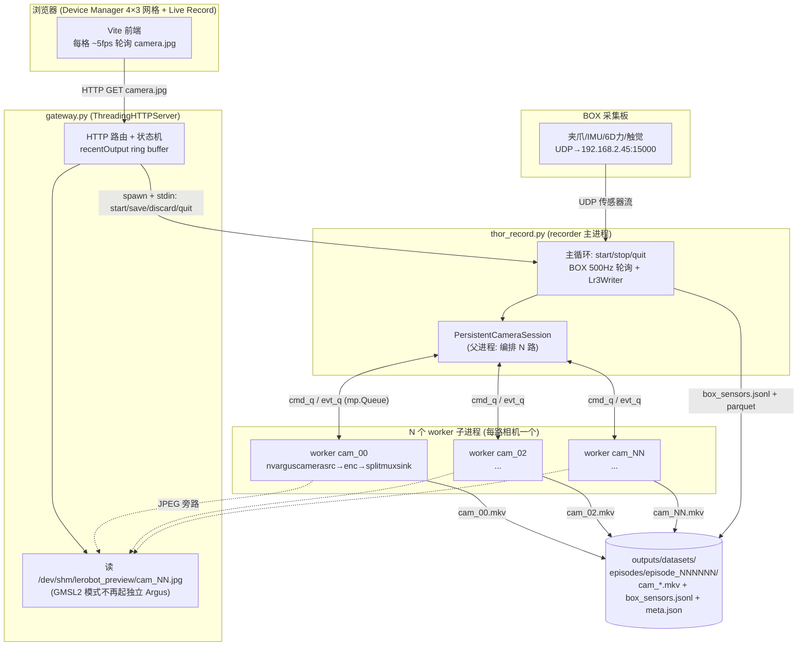
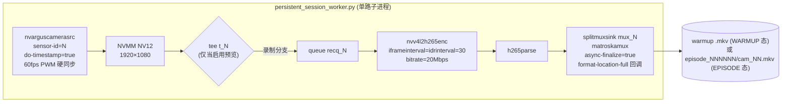
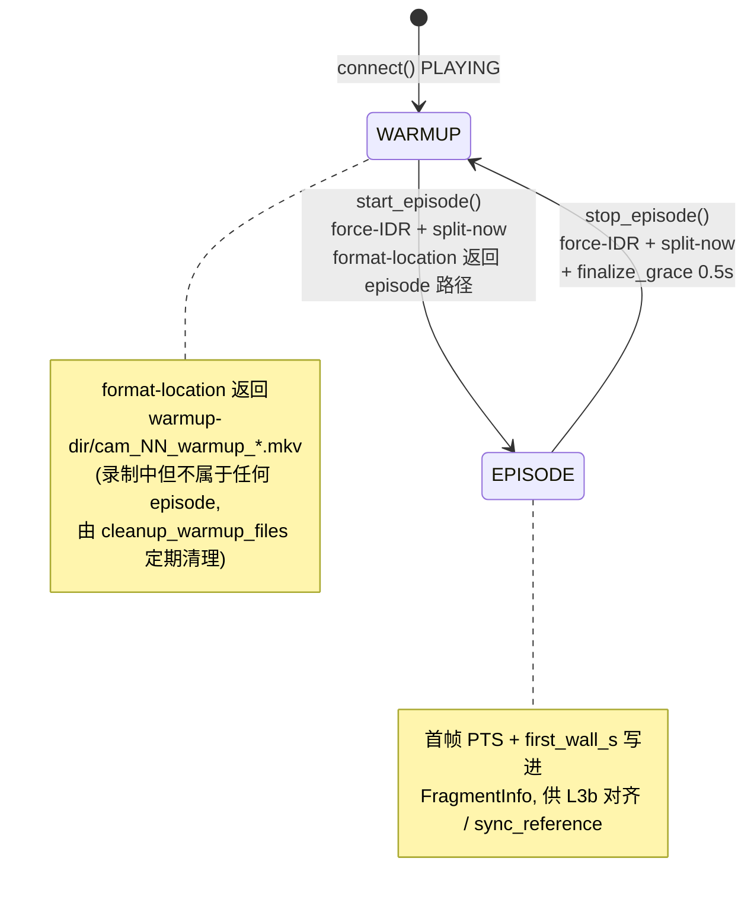
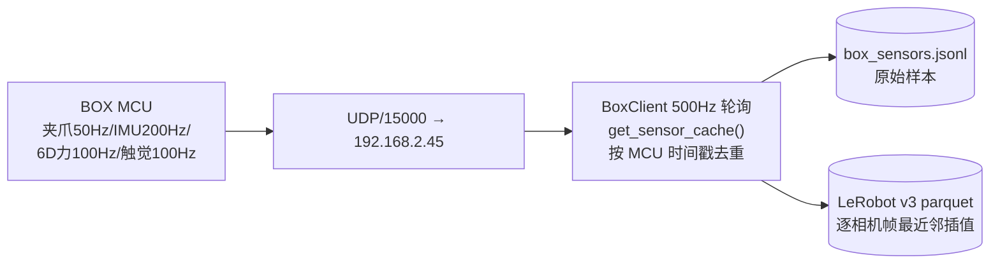
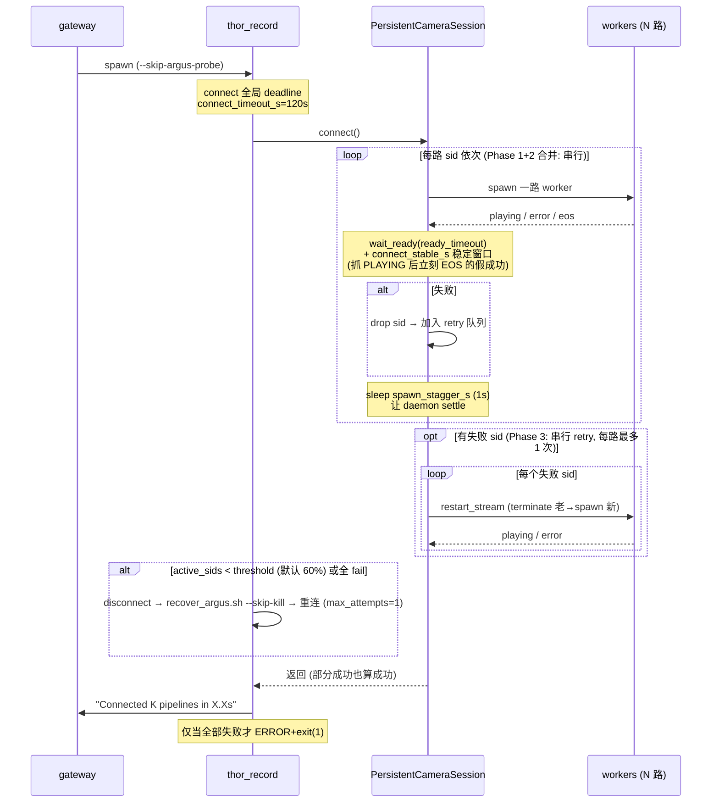
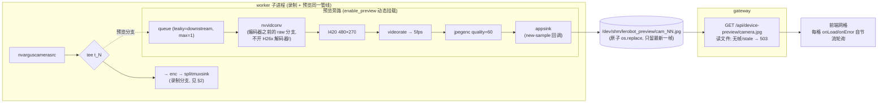

# Thor 11 路相机录制 / 预览数据流

> 本文基于 `tools/thor/DEPLOYMENT.md` 与以下代码整理：
> - `tools/thor/gmsl2/thor_record.py`（recorder 主进程）
> - `tools/thor/gmsl2/persistent_session.py`（父进程：N 路 worker 编排）
> - `tools/thor/gmsl2/persistent_session_worker.py`（子进程：单路 GStreamer 管线）
> - `tools/data_collection_gui/gateway.py`（HTTP gateway + 前端预览服务）
>
> 适用配置：`thor_gmsl2_11ch_example.yaml`（11 路 GMSL2 相机 60fps 硬同步 + 6 路 BOX 传感器）。

---

## 1. 全局架构

整套系统是**三层进程 + 两套独立数据通路**：

- **进程层**：浏览器 → Vite 前端 → gateway（HTTP，`ThreadingHTTPServer`）→ recorder 主进程（`thor_record.py`）→ N 个 camera worker 子进程 + BOX SDK。
- **录制通路**（落盘）：`nvarguscamerasrc → nvenc → splitmuxsink → episode .mkv`，每路相机一个独立子进程。
- **预览通路**（不落盘、只看画面）：在录制管线的 **编码器之前** tee 出一条 raw 分支 → 缩放 → JPEG → `/dev/shm/lerobot_preview/cam_NN.jpg`，gateway 直接读文件回给前端。

关键设计点：**预览与录制共用同一条 Argus 管线**（同一个 worker、同一个 `nvarguscamerasrc`），预览只是录制管线上动态挂载的一条旁路 tee 分支。这是 2026-06-03 排障后的核心结论——预览不再启动任何独立的 `nvarguscamerasrc`，从根上消除"预览抢相机导致 Connect 卡死 / VIC-NVDEC 资源耗尽"两类坑。

---

## 2. 录制数据流（落盘通路）

每路相机由一个独立子进程持有一条**长生命周期** GStreamer 管线。Connect 时一次性 spawn 完毕，之后每个 episode 不再重启管线，靠 `splitmuxsink` 的 `split-now` 在 IDR 边界切片。

**WARMUP / EPISODE 状态机**（每路 worker 独立维护）：

要点：
- **始终在录**：管线长期 PLAYING，相机一直出帧；非 episode 期间写入 warmup `.mkv`（会被定期清理），episode 期间写入 `episode_NNNNNN/cam_NN.mkv`。这样 StartEpisode 不再付 ~11s 的相机启动开销，切片延迟仅 100–500ms。
- **IDR 对齐**：`iframeinterval == idrinterval == 30`，因为 `splitmuxsink` 只能在 IDR 边界切；`stop_episode` 也要 `force-IDR`，否则末尾丢 0–1s 帧。
- **父子协议**：父进程 `_StreamProxy` ←→ 子进程经两条 `mp.Queue`：
  - `cmd_q`（父→子）：`start_episode / stop_episode / enable_preview / disable_preview / disconnect`
  - `evt_q`（子→父）：`playing / fragment / episode_done / error / eos / disconnected`

### BOX 传感器通路

与相机通路**时钟域完全独立**（无硬件公共时基）：

---

## 3. Connect 序列（保守串行模型）

这是整套方案最敏感的部分——11 路 `nvarguscamerasrc` 并发 Argus open 会撞 `NvBufSurfaceFromFd Failed` / `dmabuf_fd -1`。当前（2026-06-03 后）采用**保守串行**模型，放弃了早期的并行 retry：

关键策略（DEPLOYMENT.md §10 沉淀）：
- **partial-failure 容忍**：单路失败不 raise，drop 后剩余路继续录；只有全 fail 才 `exit(1)`。
- **PLAYING 后稳定窗口** `connect_stable_s`：实机观察到 sid 先 PLAYING 随后立刻 EOS/TIMEOUT，稳定窗口把假成功抓进 retry。
- **auto-recover 用 `--skip-kill`**：内部调 `recover_argus.sh` 时必须带 `--skip-kill`，否则脚本默认 `pkill` 会把 recorder 自己和 gateway 一起杀掉。
- **全局 wall-clock deadline** `connect_timeout_s`：超预算主动 teardown 并输出明确 `ERROR:` 行，避免串行耗尽单路 Argus timeout。
- **可选两阶段 spawn** `two_phase_connect`（默认 off）：Phase 1 并行把全部 worker 拉到 PAUSED（不开 Argus、无竞争），Phase 2 再串行触发 PLAYING——上图 Phase 1/2 的串行 spawn 只压缩进程启动开销，PLAYING 串行化与稳定窗口不变。详见 §6.2(2)。

---

## 4. 预览数据流（不落盘通路）

预览**完全寄生在录制管线上**，不开新 Argus client：

要点：
- **为什么不是每路一条 MJPEG 长连接**：① 浏览器对同 origin 只允许 ~6 条并发长连接，11 路必然有 5 路无限排队；② 旧单进程槽互杀。改成"服务端写最新帧 JPEG 文件 + 前端短轮询"后，6 条连接轮着用绰绰有余。
- **预览从编码器之前 tee**：早期从编码后 H26x 流再 `nvv4l2decoder` 回 JPEG，11 路等于额外 11 个硬解码器，撞 `tegra-vic ... all memory contexts are busy`。现在走 raw 分支只做 `nvvidconv` 缩放，不开解码器。
- **GMSL2 模式 gateway 只读文件**：`_should_use_recorder_camera_preview` 在 GMSL2 / recorder 运行 / suspended 时返回 True，gateway 永远只读 `/dev/shm` 那张 JPEG，绝不 spawn 独立 `gst-launch nvarguscamerasrc`。recorder 没起或还没出帧 → 503。
- **预览生命周期挂在录制上**：所有 enable/disable + stale watchdog 都跑在 recorder 的独立线程 `_preview_control_loop`（与 start/save/quit 命令循环解耦，错峰 enable 的 sleep 不阻塞命令处理）；recorder 退出预览即消失。
- **按需启停（on-demand，2026-06-04，默认开）**：`recording_preview_on_demand: true` 时预览**不**在 Connect 时常驻挂载，而是仿照 idle 预览的 TTL：只在前端真的在轮询时才挂 11 路预览旁路，没人看 `recording_preview_idle_ttl_s`（默认 6s）后自动 `disable_previews` 收掉。机制：gateway 的 `camera.jpg` snapshot 路由每次被轮询就向 recorder stdin 发一条去抖（≤1/s）的 `preview_demand` 心跳（`_maybe_send_preview_demand`，连 503 都发——没人看时 JPEG 不存在，这一下 503 正是唤醒预览的信号，且所有 stdin 写经 `_RECORDER_STDIN_LOCK` 串行化防止与 save/quit 交错）；recorder 的 stdin reader 把心跳记进 `preview_demand_at`，`_preview_control_loop` 据 `_preview_demand_decision(on_demand, active, last_demand, now, ttl)` 决定挂/收。**动机**：常驻 11×nvvidconv+jpegenc 的 idle 负载是 GMSL2/Argus stream-on 崩溃的诱因（DEPLOYMENT.md §6.2 / 2026-06-03 armed-idle EOS storm）；没人看时收掉预览就把这份 idle 负载降到零。`recording_preview_on_demand: false` 回到 legacy 常驻（Connect 时 eager `enable_previews` + `wait_preview_frames` + 全程 watchdog）。
- **watchdog 只在挂载且过 grace 窗后跑** `refresh_stale_previews` 重启卡死的预览旁路（只动预览分支，不动录制）。
- **死流不再空转重启预览（2026-06-04）**：JPEG stale 有两种原因——① 仅预览旁路卡死、录制仍 PLAYING（重启旁路即可救）；② 整条录制管线已 `bus EOS`/Argus 崩溃，上游 `nvarguscamerasrc` 已死（重启旁路永远出不了帧）。`_StreamProxy.recording_failed`（worker 任一 error/eos 事件置位、由 `restart_stream` 换新 proxy 才清零）区分二者：死流只 `logger.warning` 报一次「preview down: recording stream is dead」然后跳过，不再每 2s `disable+enable` 刷屏。这修掉了 2026-06-03 外场「11 路 EOS 后 `Preview stale: restarted ...` 无限刷屏」。死流的恢复仍归 `poll_errors()`/操作员重连，watchdog 不越权。

---

## 5. 时间同步与数据落盘

| 数据源 | 时钟 | 对齐方式 |
| --- | --- | --- |
| 11 路相机 | 60Hz PWM 硬同步（亚微秒，L0） | 帧间隔严格 1/fps |
| BOX 传感器 | MCU 独立时钟 | 主机 `time.time()` 轮询时刻 |

两套时钟域**无硬件级公共基准**，靠 `meta.json` 的 `sync_reference`（`split_now_wall_s` / `camera_first_wall_s` / `camera_first_pts_s`）做软对齐：
- 跨相机锚点用 `camera_first_wall_s`（host wall-clock，可比），实测精度 ~19.5ms（受 `iframe_interval` 主导）。
- L3b 增强对齐：MKV PTS 提取 + BOX 侧 MCU↔Host 线性回归，精度 ±0.5~1ms。
- 导出（`export_v3.py`）：源 HEVC → H.264 + CFR（`videorate` 重排到 `i/fps` 网格），逐相机帧数取 min，best-effort 合并。

落盘布局：`outputs/datasets/<repo>/episodes/episode_NNNNNN/{cam_*.mkv, box_sensors.jsonl, meta.json}`。

---

## 6. 方案合理性分析

### 6.1 设计上站得住的部分 ✅

1. **多进程隔离（PR3 核心）是正确的架构决策。**
   PR2 曾把 11 路塞进单 Python 进程，nvargus-daemon 看到"1 client 持 11 个 CaptureSession 共用一条 socket"，恢复路径不稳定 + `set_state(PLAYING)` 死锁会拖垮整个进程。改成"每路 1 子进程 = N 个独立 RPC client"恢复了 daemon 的 per-socket 隔离，单路死锁不波及其他路，且诊断可定位到 sid。这是符合 nvargus-daemon 实际行为模型的修复，不是 workaround。

2. **持久管线 + split-now 切片在 UX 上明显优于"每 episode 重启 11 路"。**
   StartEpisode 从 ~11s 降到 100–500ms，对高频采集是实质收益。代价（始终在录 warmup、需定期 cleanup）是可控的。

3. **预览寄生在录制管线、gateway 只读文件**——这是经过三轮实机排障收敛出的解，同时干掉了三个独立的坑（独立 Argus 抢相机、H26x 解码器耗尽 VIC、浏览器连接上限）。把预览降级为"录制管线上一条可丢帧的旁路 + 内存文件 + 短轮询"，资源耦合度最低，是合理的。

4. **partial-failure 容忍 + 阈值 auto-recover** 贴合外场实际：硬件层本就会有路锁不上，"能录几路录几路 + 前端如实显示 active 列表"比"一路失败全盘 ERROR"实用。

5. **可测试性好**：事件分发 `_apply_event_to_proxy`、`_fragment_dict`、auto-recover 决策都拆成 module-level 纯函数，dev host 无 `gi` 也能跑 60+ 测试。这对一个充满硬件时序坑的系统很重要。

### 6.2 值得警惕 / 潜在问题 ⚠️

1. **根因在驱动层，软件只能隔离不能根治。**
   DEPLOYMENT.md §10「2026-06-03」明确：clean recover 后**单路 probe** 仍会 `ar0234c i2c write failed` / `Error turning on streaming` / `Sensor GUID in error state`。Python/GStreamer 编排做到了隔离、降载、检测、recover，但 `i2c write failed` 这类是线束/供电/serializer-deserializer/CSI/RCE 层的问题。**当前方案的稳定性上限被驱动层封死**，软件侧再优化收益递减——应推动硬件/驱动侧排查（建议步骤 DEPLOYMENT.md 已列）。

2. **串行 Connect 慢 → 已加强：PR7 两阶段 spawn（默认 opt-in）。** ✅ 已实现并实机验证

   原状：为躲 NVMM race，11 路串行 spawn（每路 init→PLAYING→稳定窗口→下一路），其中每路 spawn 都付 ~1.2s 的 python 进程 + `Gst.init` + `parse_launch` 启动开销，串行累加 ~13s。

   **实机实证修正了原始 PR7 假设**：文档原先设想"先 READY 再串行 PLAYING"，但在 Thor 上实测 `nvarguscamerasrc`（live source）的状态机是——`NULL→READY` 0.04s、`READY→PAUSED` **0.001s 且返回 NO_PREROLL，完全不开 Argus**（无任何 `GST_ARGUS` 输出）、`PAUSED→PLAYING` **0.72s 才创建 CaptureSession + 分配 NVMM**。即 Argus 开销 100% 在 PLAYING，READY/PAUSED 阶段是空操作。所以"并行 READY 重叠 Argus open"是个伪命题；真正可压缩的是被串行化的 **进程/Gst 启动开销**。

   **修正后的实现**（`two_phase_connect`，YAML `sensors.cameras.two_phase_connect`，默认 `false`）：
   - **Phase 1**：一次性并行 spawn 全部 worker，各自 init + `set_state(PAUSED)`。PAUSED 不开 Argus、不碰 daemon，无竞争，N 路启动开销重叠。
   - **Phase 2**：父进程串行对每路 `play()` 触发 `PAUSED→PLAYING`，等 PLAYING + 稳定窗口，再下一路。**贵且有竞争的 Argus bring-up 顺序与原 serial 完全一致**，稳定性不退化。
   - retry（Phase 3）仍走单路 `restart_stream`（单阶段直接 PLAYING），逐路恢复不变。

   **实机 A/B（同一台 Thor、同 11 sid、stagger=1.0/stable=1.0）**：

   | 指标 | serial（基线） | two-phase |
   | --- | --- | --- |
   | 全部 worker init→PAUSED | ~13s（串行 11×~1.2s） | **1.40s（11/11 并发）** |
   | first-pass 末路 PLAYING | +71.1s（cam_15） | **+36.9s（cam_15）** |

   关键：Phase 1 的 `11/11 PAUSED (+1.40s)` 与 Argus 无关，即便当时硬件 PLAYING 抽风（cam_04/07/09/11 失败）也能稳定拿到 11/11——这正是设计目标。两阶段把 first-pass 连接时延砍掉约一半，且没有改变高风险 PLAYING 的串行化方式。Phase 2 每路 ~3.2s（1s stagger + 1s stable + ~0.7–2.2s play）是为稳定性付的不可压缩串行成本，两阶段不动它。**默认 `false` 保留 proven serial，待外场 burn-in 后再考虑切默认。**

   注意：这只优化 Connect *时延*，不改变 PLAYING *成功率*——后者仍受第 1 条的驱动层硬伤封顶（实机仍有路在 PLAYING 阶段 `bus EOS`，是同一个 i2c/stream-on 问题）。

3. **`finalize_grace_s=0.5s` 魔法常量 → 已加强：等 `splitmuxsink-fragment-closed` 消息。** ✅ 已实现并实机验证

   原状：`stop_episode` 盲等 0.5s 让 async-finalize 落盘，文档据"splitmuxsink 1.20 不暴露 finalize-done 信号"。**但 Thor 实际是 GStreamer 1.24.2**，`splitmuxsink` 在 async-finalize 下会发 `splitmuxsink-fragment-closed` 总线 ELEMENT 消息（带 `location` 字段）——文档的前提过时了。

   实现（`persistent_session_worker.py`）：worker 在 bus 上监听该消息记录已关闭的 location；`stop_episode` 的 `split-now` 恰好关闭 EPISODE fragment 并触发该消息，于是改为**等这条消息**（`_wait_fragment_finalized`，上限 `FINALIZE_FRAGMENT_TIMEOUT_S=3.0s`），消息一到立即 `episode_done`；只有消息丢失或本就没开过 EPISODE fragment 时才回退到 0.5s grace sleep。父进程 `stop_episode` 超时同步抬到 `FINALIZE_FRAGMENT_TIMEOUT_S + finalize_grace_s + 1.5`。

   验证：① videotestsrc 探针在 Thor 1.24 上确认 `split-now` 后立即收到 `splitmuxsink-fragment-closed location=<刚关闭的文件>`；② 实机 11 路 serial 录制 episode，fragment 正常落盘（`cam_04=1.2MB` 等），`stop` 在 3.01s 干净返回无挂死。从"盲等固定时长"变成"文件确实关闭即返回"，正常路径更快、慢 IO 也不再可能返回半成品。

4. **时间同步是软对齐，L2 仍未实现。**
   两套时钟域无公共硬件基准，跨相机~19.5ms、相机↔BOX 依赖 wall-clock 轮询时刻。对需要严格跨模态对齐的下游训练，L4（BOX MCU 也由 PWM 触发）才是终态；当前 L3b 的 ±0.5~1ms 已经不错，但导出 L2（PTS 级 wall-clock 对齐）还是 🔲。

5. **`camera_preview_suspended` 状态收口 → 已加强：context manager。** ✅ 已实现并单测

   原状：Connect 把 `suspended=True` 设在请求的 `try` **之外**，复位散落在 `_snapshot`（recorder 退出）/ `_stop_recorder` / connect 的 `except` 三处。preflight（`_stop_all_camera_previews` / settle sleep）一旦抛错就没人复位 → 预览永久 409。

   实现（`gateway.py`）：新增 `@contextmanager _previews_suspended_for_connect(state)` 包住整个 preflight + spawn。语义为"全有全无"——**成功保持 True**（recorder 已接管相机，后续由 `_stop_recorder`/`_snapshot` 复位）；**任何异常 finally 复位 False**。`do_POST` 的 connect 分支整体搬进该 CM + 自己的 try/except，并删掉原 generic except 里的 connect 特判。新增 connect 早退路径不再有忘记复位的隐患。

   验证：2 个新单测 `test_previews_suspended_for_connect_keeps_flag_on_success`（成功保持 True）/ `_resets_flag_on_any_exception`（异常复位 False）通过。

### 6.3 小结

**架构方向是对的**：多进程隔离、持久管线切片、预览寄生 + 文件轮询，都是针对 Jetson/Argus/NVMM 真实约束收敛出来的合理解，且有测试和实机日志支撑。**当前的主要瓶颈不在这套 Python/GStreamer 编排，而在其下的 GMSL2 驱动/sensor stream-on 状态机**——软件层已接近"隔离+恢复"能做到的上限。

本轮已落地 §6.2 的三项加强（均实机/单测验证）：(3) finalize 从盲等改为等 `splitmuxsink-fragment-closed`（Thor 实为 GStreamer 1.24，原"1.20 无信号"前提过时）；(5) `camera_preview_suspended` 用 context manager 全有全无收口；(2) PR7 两阶段 spawn（默认 opt-in）把 first-pass 连接时延从 ~71s 砍到 ~37s——实证修正了原始假设（PAUSED 不开 Argus，可压缩的是被串行化的进程/Gst 启动而非 Argus open）。

剩余优先级：**推动驱动/硬件侧排查 i2c/stream-on 失败**——这是封住 PLAYING 成功率上限的硬伤，§6.2(2) 的连接提速只改善时延、改善不了成功率。其次：L2 导出时 PTS 级对齐（§6.2.4）；two_phase_connect 外场 burn-in 后评估是否切默认。

### 6.4 本轮改动清单（2026-06-03）

| 文件 | 改动 |
| --- | --- |
| `persistent_session_worker.py` | `run_worker(two_phase=...)`：PAUSED→等 `play`→PLAYING 两阶段；bus 监听 `splitmuxsink-fragment-closed`，`stop_episode` 等该消息替代盲等 |
| `persistent_session.py` | `PersistentCameraSession(two_phase_connect=...)`；connect 拆 `_first_pass_serial` / `_first_pass_two_phase`；`_StreamProxy` 加 `paused_evt`/`wait_paused`/`play`/`spawn(two_phase=)`；`FINALIZE_FRAGMENT_TIMEOUT_S` 常量 + stop_episode 超时同步；demo CLI 加 `--two-phase`/`--connect-stable-s` |
| `gmsl2_record.py` / `thor_record.py` | YAML `two_phase_connect` 读取并透传给 PersistentCameraSession |
| `thor_gmsl2_11ch_example.yaml` | 新增 `two_phase_connect: false`（带说明） |
| `gateway.py` | `@contextmanager _previews_suspended_for_connect`；connect 分支整体收口，删 generic except 特判 |
| 测试 | multiprocess +3（两阶段 ordering/paused-fail/play-retry）、gateway +2（CM 成功/异常）、修正 1 个 stale `build_pipeline_desc` 断言 + 1 个 spawn-kwargs 断言；合计 125 passed |
