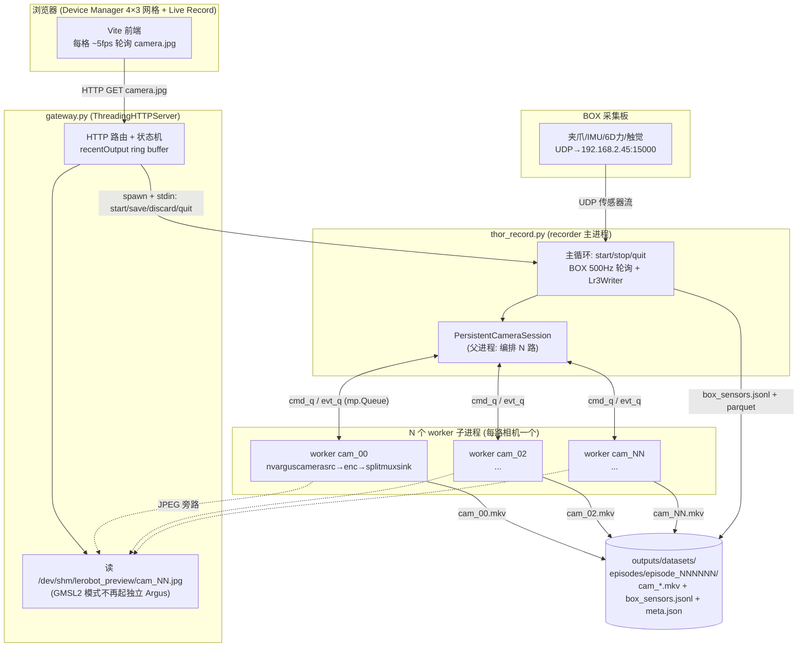
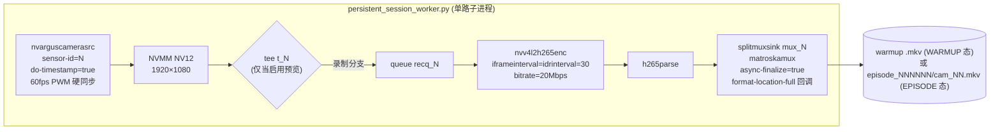
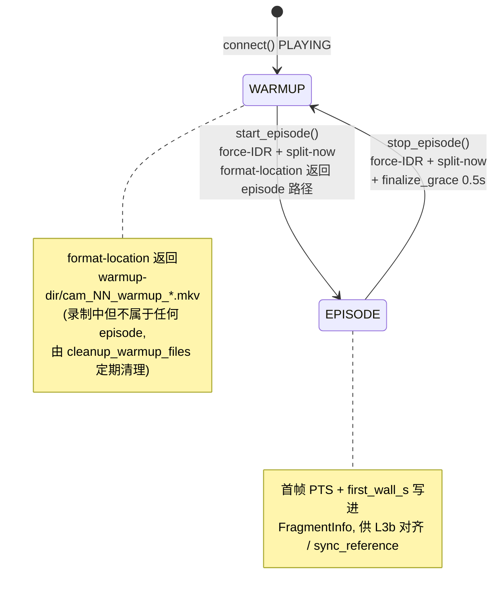
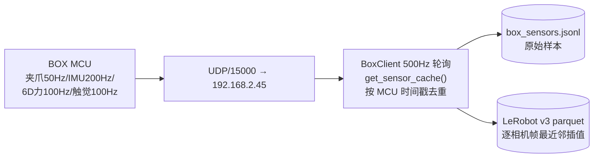
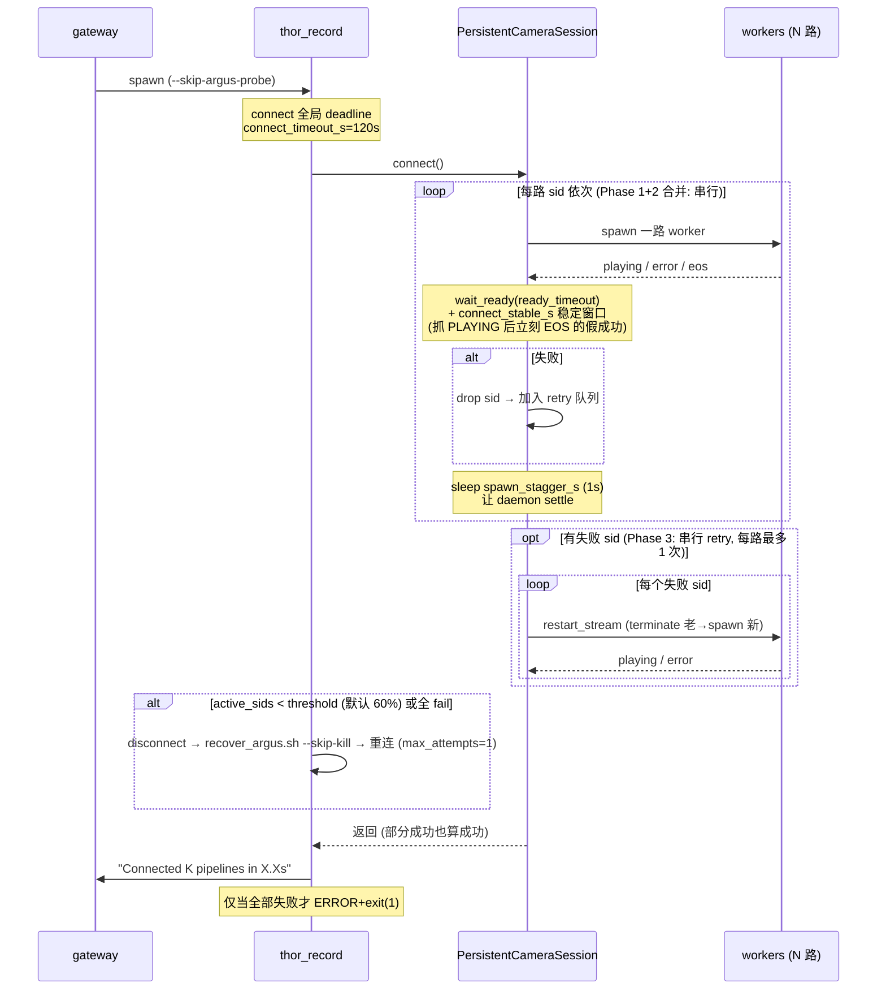
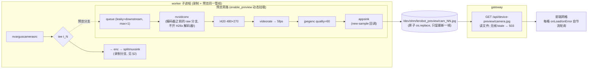

# Thor 11 路相机录制 / 预览数据流

> 本文基于 `tools/thor/DEPLOYMENT.md` 与以下代码整理：
> - `tools/thor/gmsl2/thor_record.py`（recorder 主进程）
> - `tools/thor/gmsl2/persistent_session.py`（父进程：N 路 worker 编排）
> - `tools/thor/gmsl2/persistent_session_worker.py`（子进程：单路 GStreamer 管线）
> - `tools/data_collection_gui/gateway.py`（HTTP gateway + 前端预览服务）
>
> 适用配置：`thor_gmsl2_11ch_example.yaml`（11 路 GMSL2 相机 60fps 硬同步 + 6 路 BOX 传感器）。

---

## 1. 全局架构

整套系统是**三层进程 + 两套独立数据通路**：

- **进程层**：浏览器 → Vite 前端 → gateway（HTTP，`ThreadingHTTPServer`）→ recorder 主进程（`thor_record.py`）→ N 个 camera worker 子进程 + BOX SDK。
- **录制通路**（落盘）：`nvarguscamerasrc → nvenc → splitmuxsink → episode .mkv`，每路相机一个独立子进程。
- **预览通路**（不落盘、只看画面）：在录制管线的 **编码器之前** tee 出一条 raw 分支 → 缩放 → JPEG → `/dev/shm/lerobot_preview/cam_NN.jpg`，gateway 直接读文件回给前端。

关键设计点：**预览与录制共用同一条 Argus 管线**（同一个 worker、同一个 `nvarguscamerasrc`），预览只是录制管线上动态挂载的一条旁路 tee 分支。这是 2026-06-03 排障后的核心结论——预览不再启动任何独立的 `nvarguscamerasrc`，从根上消除"预览抢相机导致 Connect 卡死 / VIC-NVDEC 资源耗尽"两类坑。

---

## 2. 录制数据流（落盘通路）

每路相机由一个独立子进程持有一条**长生命周期** GStreamer 管线。Connect 时一次性 spawn 完毕，之后每个 episode 不再重启管线，靠 `splitmuxsink` 的 `split-now` 在 IDR 边界切片。

**WARMUP / EPISODE 状态机**（每路 worker 独立维护）：

要点：
- **始终在录**：管线长期 PLAYING，相机一直出帧；非 episode 期间写入 warmup `.mkv`（会被定期清理），episode 期间写入 `episode_NNNNNN/cam_NN.mkv`。这样 StartEpisode 不再付 ~11s 的相机启动开销，切片延迟仅 100–500ms。
- **IDR 对齐**：`iframeinterval == idrinterval == 30`，因为 `splitmuxsink` 只能在 IDR 边界切；`stop_episode` 也要 `force-IDR`，否则末尾丢 0–1s 帧。
- **父子协议**：父进程 `_StreamProxy` ←→ 子进程经两条 `mp.Queue`：
  - `cmd_q`（父→子）：`start_episode / stop_episode / enable_preview / disable_preview / disconnect`
  - `evt_q`（子→父）：`playing / fragment / episode_done / error / eos / disconnected`

### BOX 传感器通路

与相机通路**时钟域完全独立**（无硬件公共时基）：

---

## 3. Connect 序列（保守串行模型）

这是整套方案最敏感的部分——11 路 `nvarguscamerasrc` 并发 Argus open 会撞 `NvBufSurfaceFromFd Failed` / `dmabuf_fd -1`。当前（2026-06-03 后）采用**保守串行**模型，放弃了早期的并行 retry：

关键策略（DEPLOYMENT.md §10 沉淀）：
- **partial-failure 容忍**：单路失败不 raise，drop 后剩余路继续录；只有全 fail 才 `exit(1)`。
- **PLAYING 后稳定窗口** `connect_stable_s`：实机观察到 sid 先 PLAYING 随后立刻 EOS/TIMEOUT，稳定窗口把假成功抓进 retry。
- **auto-recover 用 `--skip-kill`**：内部调 `recover_argus.sh` 时必须带 `--skip-kill`，否则脚本默认 `pkill` 会把 recorder 自己和 gateway 一起杀掉。
- **全局 wall-clock deadline** `connect_timeout_s`：超预算主动 teardown 并输出明确 `ERROR:` 行，避免串行耗尽单路 Argus timeout。

---

## 4. 预览数据流（不落盘通路）

预览**完全寄生在录制管线上**，不开新 Argus client：

要点：
- **为什么不是每路一条 MJPEG 长连接**：① 浏览器对同 origin 只允许 ~6 条并发长连接，11 路必然有 5 路无限排队；② 旧单进程槽互杀。改成"服务端写最新帧 JPEG 文件 + 前端短轮询"后，6 条连接轮着用绰绰有余。
- **预览从编码器之前 tee**：早期从编码后 H26x 流再 `nvv4l2decoder` 回 JPEG，11 路等于额外 11 个硬解码器，撞 `tegra-vic ... all memory contexts are busy`。现在走 raw 分支只做 `nvvidconv` 缩放，不开解码器。
- **GMSL2 模式 gateway 只读文件**：`_should_use_recorder_camera_preview` 在 GMSL2 / recorder 运行 / suspended 时返回 True，gateway 永远只读 `/dev/shm` 那张 JPEG，绝不 spawn 独立 `gst-launch nvarguscamerasrc`。recorder 没起或还没出帧 → 503。
- **预览生命周期挂在录制上**：`connect()` 全部 active 流稳定后才 `enable_previews`（错峰挂载）；watchdog 定期 `refresh_stale_previews` 重启卡死的预览旁路（只动预览分支，不动录制）；recorder 退出预览即消失。

---

## 5. 时间同步与数据落盘

| 数据源 | 时钟 | 对齐方式 |
| --- | --- | --- |
| 11 路相机 | 60Hz PWM 硬同步（亚微秒，L0） | 帧间隔严格 1/fps |
| BOX 传感器 | MCU 独立时钟 | 主机 `time.time()` 轮询时刻 |

两套时钟域**无硬件级公共基准**，靠 `meta.json` 的 `sync_reference`（`split_now_wall_s` / `camera_first_wall_s` / `camera_first_pts_s`）做软对齐：
- 跨相机锚点用 `camera_first_wall_s`（host wall-clock，可比），实测精度 ~19.5ms（受 `iframe_interval` 主导）。
- L3b 增强对齐：MKV PTS 提取 + BOX 侧 MCU↔Host 线性回归，精度 ±0.5~1ms。
- 导出（`export_v3.py`）：源 HEVC → H.264 + CFR（`videorate` 重排到 `i/fps` 网格），逐相机帧数取 min，best-effort 合并。

落盘布局：`outputs/datasets/<repo>/episodes/episode_NNNNNN/{cam_*.mkv, box_sensors.jsonl, meta.json}`。

---

## 6. 方案合理性分析

### 6.1 设计上站得住的部分 ✅

1. **多进程隔离（PR3 核心）是正确的架构决策。**
   PR2 曾把 11 路塞进单 Python 进程，nvargus-daemon 看到"1 client 持 11 个 CaptureSession 共用一条 socket"，恢复路径不稳定 + `set_state(PLAYING)` 死锁会拖垮整个进程。改成"每路 1 子进程 = N 个独立 RPC client"恢复了 daemon 的 per-socket 隔离，单路死锁不波及其他路，且诊断可定位到 sid。这是符合 nvargus-daemon 实际行为模型的修复，不是 workaround。

2. **持久管线 + split-now 切片在 UX 上明显优于"每 episode 重启 11 路"。**
   StartEpisode 从 ~11s 降到 100–500ms，对高频采集是实质收益。代价（始终在录 warmup、需定期 cleanup）是可控的。

3. **预览寄生在录制管线、gateway 只读文件**——这是经过三轮实机排障收敛出的解，同时干掉了三个独立的坑（独立 Argus 抢相机、H26x 解码器耗尽 VIC、浏览器连接上限）。把预览降级为"录制管线上一条可丢帧的旁路 + 内存文件 + 短轮询"，资源耦合度最低，是合理的。

4. **partial-failure 容忍 + 阈值 auto-recover** 贴合外场实际：硬件层本就会有路锁不上，"能录几路录几路 + 前端如实显示 active 列表"比"一路失败全盘 ERROR"实用。

5. **可测试性好**：事件分发 `_apply_event_to_proxy`、`_fragment_dict`、auto-recover 决策都拆成 module-level 纯函数，dev host 无 `gi` 也能跑 60+ 测试。这对一个充满硬件时序坑的系统很重要。

### 6.2 值得警惕 / 潜在问题 ⚠️

1. **根因在驱动层，软件只能隔离不能根治。**
   DEPLOYMENT.md §10「2026-06-03」明确：clean recover 后**单路 probe** 仍会 `ar0234c i2c write failed` / `Error turning on streaming` / `Sensor GUID in error state`。Python/GStreamer 编排做到了隔离、降载、检测、recover，但 `i2c write failed` 这类是线束/供电/serializer-deserializer/CSI/RCE 层的问题。**当前方案的稳定性上限被驱动层封死**，软件侧再优化收益递减——应推动硬件/驱动侧排查（建议步骤 DEPLOYMENT.md 已列）。

2. **串行 Connect 慢，且与稳定性此消彼长。**
   为躲 NVMM race 放弃了并行 retry，11 路串行 spawn + 稳定窗口 + 串行 retry，不健康 daemon 下 Connect 可达 ~80s（首连 + recover + 重连）。这是"稳定性优先"的刻意取舍，但操作员等待体验差。彻底解法是 DEPLOYMENT.md 提到的 **PR7（worker 两阶段 spawn：先 READY 再由父进程串行触发 PLAYING）** 或修了 race 的新 driver——在那之前 Connect 时长是结构性的。

3. **`finalize_grace_s=0.5s` 是魔法常量兜底。**
   `splitmuxsink`(1.20) 不暴露 finalize-done 信号，stop_episode 靠 sleep 0.5s 等 async-finalize 落盘。若某路 IO 抖动超过 0.5s，`episode_done` 可能带着未完全 flush 的 fragment 返回。这是已知的脆弱点（被 `wait_episode_done` 的 `finalize_grace_s + 1.5` 超时部分缓解），但不是确定性保证。

4. **时间同步是软对齐，L2 仍未实现。**
   两套时钟域无公共硬件基准，跨相机~19.5ms、相机↔BOX 依赖 wall-clock 轮询时刻。对需要严格跨模态对齐的下游训练，L4（BOX MCU 也由 PWM 触发）才是终态；当前 L3b 的 ±0.5~1ms 已经不错，但导出 L2（PTS 级 wall-clock 对齐）还是 🔲。

5. **`camera_preview_suspended` 标志的并发正确性依赖较多隐式约定。**
   Connect 前置流程（置 suspended → stop all previews 在 lock 外 → settle → connect）跨多个状态位，复位点散落在 recorder 退出 / `_stop_recorder` / connect 失败 except 三处。逻辑正确但脆——任何新增的 connect 早退路径都得记得复位，否则预览永久 409。建议考虑用 context manager / try-finally 收口。

### 6.3 小结

**架构方向是对的**：多进程隔离、持久管线切片、预览寄生 + 文件轮询，都是针对 Jetson/Argus/NVMM 真实约束收敛出来的合理解，且有测试和实机日志支撑。**当前的主要瓶颈不在这套 Python/GStreamer 编排，而在其下的 GMSL2 驱动/sensor stream-on 状态机**——软件层已接近"隔离+恢复"能做到的上限。短期工程优先级建议：(1) 推动驱动/硬件侧排查 i2c/stream-on 失败；(2) 评估 PR7 两阶段 spawn 以同时改善 Connect 时延与 NVMM race；(3) 把 `camera_preview_suspended` 的状态管理收口，降低后续维护出错概率。
